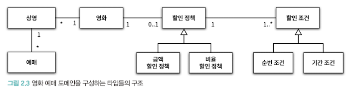
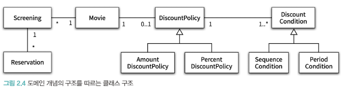
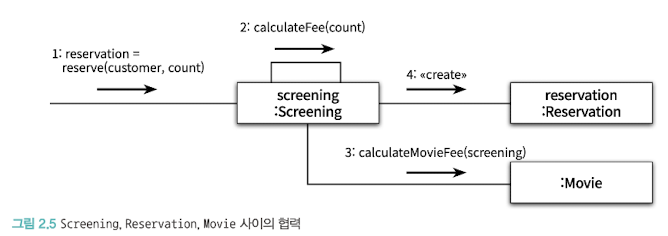

# 객체지향 프로그래밍

이번 장의 목표는 뒤에서 다룰 다양한 주제를 얕은 살펴보는 장이다.
영화 예매 시스템을 알아보자!

## 1. 영화 예매 시스템

> 요구 사항

- 영화(movie): 영화에 대한 기본 정보
- 상영(screening): 관객들이 영화를 관람하는 사건
- 할인조건(discount condition): 할인 여부를 결정
  - 순서조건: 상영 순번을 이용해 할인 여부를 결정(ex. 매일 10번쨰로 상영되는 영화를 예매한 사용자들에게 할인 혜택을 제공)
  - 기간조건: 상영 시작 시간을 이용해 할인 여부를 결정
- 할인정책(discount policy): 할인 요금을 결정
  - 금액 할인 정책: 일정 금액을 할인해주는 방식
  - 비율 할인 정책: 일정 비율의 요금을 할인해 주는 방식

## 2. 객체지향 프로그래밍을 향해

### 협력, 객체, 클래스

객체지향은 객체를 지향하는 것이다. 클래스가 아닌 객체에 초점을 맞춰야 한다.

1. 어떤 클래스가 필요한지를 고민하기 전에 어떤 객체들이 필요한지 고민하라.
   => 클래스는 공통적인 상태와 행동을 공유하는 객체들을 추상화한 것이다.
2. 객체를 독립적인 존재가 아닌 기능을 구현하기 위해 협력하는 공동체의 일원으로 봐야 한다.
   => 훌륭한 협력이 훌륭한 객체를 낳고 훌륭한 객체가 훌륭한 클래스를 낳는다.

### 도메인 구조를 따르는 프그램 구조

> 도메인: 문제를 해결하기 위해 사용자가 프로그램을 사용하는 분야

객체지향 패러다임이 강력한 이유는 요구사항과 프로그램을 객체라는 동일한 관점에서 바라볼수 있기 떄문이다. 도메인을 구성하는 개념들이 프로그램의 객체와 클래스로 매끄럽게 연결되 수 있따.



### 클래스 구현하기

상영을 구현하는 Screening클래스를 구현해보자.

```run-ts
class Screening {
  private movie: Movie; // 상영할 영화
  private sequence: number; // 순번
  private whenScreened: number; // 상영 시작 시간

  constructor(movie: Movie, sequence: number, whenScreened: number) {
    this.movie = movie;
    this.sequence = sequence;
    this.whenScreened = whenScreened;
  }

  // 상영 시작 시간 반환
  public getStartTime(): number {
    return this.whenScreened;
  }

  // 순번의 일치 여부 검사
  public isSequence(sequence: number): boolean {
    return this.sequence === sequence;
  }

  // 기본 요금 반환
  public getMovieFee(): Money {
    return this.movie.getFee();
  }
}
console.log('sdsdsd')
```


인스턴스 변수는 private, 메서드는 public이다.  
클래스를 구현할때 가장 중요한 것은 클래스의 경계를 구분 짓는 것이다.  
외부에서 객체의 속성에 직접 접근할 수 없도록 막고, 적절한 public메서들 통해서만 내부 상태를 변경 할 수 있게 해야 한다.

경계의 명확성이 객체의 자율성을 보장하며, 프로그래머에게 구현의 자유를 제공하기 때문이다.

> 자율적인 객체

- 객체는 상태와 행동을 함께 가지는 복합적인 존재
- 객체는 스스로 판단하고 행동하는 자율적인 존재

객체지향은 객체라는 단위 안에 데이터와 기능을 한 덩어리로 묶어 캡슐화한다.  
대부분 객체지향 프로그래밍 언어들은 캡슐화에서 나아가 외부에서 접근을 통제할 수 있는 접근제어 매커니즘을 제공한다.  
(public, protected, private)

캡슐화의 접근제어는 객체를 두 부분으로 나눈다.

- 퍼블릭 인터페이스: 외부에서 접근 가능한 부분
- 구현: 외부에서는 접근 불가능하고 오직 내부에서만 접근 가능한 부분

인터페이스와 구현의 분리 원칙은 객체지향 핵심 원칙이다.

객체의 상태를 숨기고 행동만 외부에 공개해야 한다.  
클래스의 속성은 private으로, 외부에서 제공해야 하는 일부 메서드만 public으로 선언해야 한다.  
서브클래스나 내부에서만 접근 가능해야 할 메서드들은 protected나 private로 지정해햐 한다.

> 프로그래머의 자유

프로그래머의 역할

- 클래스 작성자: 새로운 데이터 타입을 프로그램에 추가
- 클라이언트 프로그래머: 클래스 작성자가 추가한 데이터 타입을 사용

클래스 작성자는 클라이언트 프로그래머에게 필요한 부분만 공개하고 나머지는 숨김으로써,
클라이언트 프로그래머에 대한 영향을 걱정하지 않고도 내부 구현을 마음대로 변경할 수 있다. (구현 은닉)

접근 제어 메커니즘

- 클래스의 내부와 외부를 명확하게 경계 지을 수 있게 함
- 클래스 작성자가 내부 구현을 은닉할 수 있게 함
- 클라이언트 프로그래머가 실수로 숨겨진 부분에 접근하는 것을 막아줌

설계가 필요한 이유는 변경을 관리하기 위해서다.  
객체의 변경을 관리하는 기법 중 대표적인 것이 접근 제어다.

### 협력하는 객체들의 공동체

Screening클래스에 영화를 예매하는 기능을 넣어보자
reserve메서드는 영화를 예매한 후 예매 정보를 담고 있는 Reservation 인스턴스를 생성해서 반환한다.

```ts
class Screening {
  ...
  // 영화를 예매한 후 예매 정보를 담고 있는 인스턴스를 생성해서 반환
  public reserve(
    customer: CustomElementRegistry, // 예매자 정보
    audienceCount: number // 인원수
  ): Reservation {
    return new Reservation(
      customer,
      this,
      this.calculateFee(audienceCount), //요금 계산 결과
      audienceCount
    );
  }

  private calculateFee(audienceCount: number): Money {
    // 1인 당 예매 요금 * 인원 수
    return this.movie.calculateMovieFee(this).times(audienceCount);
  }
}
```

Money는 금액과 관련된 다양한 계산을 구현하는 클래스다.

```ts
class Money {
  public ZERO: Money = Money.wons(0);

  private amount: number;

  constructor(amount: number) {
    this.amount = amount;
  }

  public static wons(amount: number): Money {
    return new Money(amount);
  }

  public plus(amount: Money): Money {
    return new Money(this.amount + amount.amount);
  }

  public minus(amount: Money): Money {
    return new Money(this.amount - amount.amount);
  }

  public times(percent: number): Money {
    return new Money(this.amount * (percent / 100));
  }

  public isLessThan(other: Money): boolean {
    return this.amount < other.amount;
  }

  public isGreaterThanOrEqual(other: Money): boolean {
    return this.amount >= other.amount;
  }
}
```

Reservation 클래스도 구현해보자.

```ts
class Reservation {
  private customer: CustomElementRegistry;
  private screening: Screening;
  private fee: Money;
  private audienceCount: number;

  constructor(
    customer: CustomElementRegistry,
    screening: Screening,
    fee: Money,
    audienceCount: number
  ) {
    this.customer = customer;
    this.screening = screening;
    this.fee = fee;
    this.audienceCount = audienceCount;
  }
}
```

Screening, Movie, Reservation 인스턴스들은 서로의 메서드를 호출하며 협력한다.


협력의 관점에서 어떤 객체가 필요한지 결정한 후, 클래스를 작성해야 한다.

객체는 다른 객체의 인터페이스에 공개된 행동을 구행하도록 요청할 수 있다.  
요청을 받은 객체는 자율적인 방법에 따라 요청을 처리한 후 응답한다.

객체끼리 상호작용할 수 있는 유일한 벙법은 메시지를 전송하는 것뿐이다.  
수신된 메시지를 처리하기 위한 자신만의 방법을 메서드라고 한다.

메시지와 메서드를 구분해야 한다. 여기에서 다형성의 개념이 출발한다.  
Screening이 Movie의 calculateMovieFee 메서드를 호출한다는 표현보다,  
calculateMovieFee 메시지를 전송한다는 표현이 더 적절하다.  
사실 Screening은 Movie 안에 calculateMovieFee 메서드의 존재도 알지 못한다.  
메시지에 응답할 수 있다고 믿고 메시지를 전송할 뿐이다.

## 3.할인 요금 구하기

Movie 클래스를 구현해보자.

```ts
class Movie {
  private title: string;
  private runningTime: number;
  private fee: Money;
  private discountPolicy?: DiscountPolicy;

  constructor(
    title: string,
    runningTime: number,
    fee: Money,
    discountPolicy?: DiscountPolicy
  ) {
    this.title = title;
    this.runningTime = runningTime;
    this.fee = fee;
    this.discountPolicy = discountPolicy;
  }

  public getFee(): Money {
    return this.fee;
  }

  public calculateMovieFee(screening: Screening): Money {
    if (!this.discountPolicy) {
      return this.fee;
    }
    return this.fee.minus(
      this.discountPolicy.calculateDiscountAmount(screening)
    );
  }
}
```

calculateMovieFee 메서드에는 어떤 할인 정책을 사용할 것인지 결정하는 코드가 없다.

### 할인 정책과 할인 조건

금액 할인 정책과 비율 할인 정책을 각각 AmountDiscountPolicy와 PercentDiscountPolicy라는 클래스로 구현하자.

두 클래스는 대부분의 코드가 유사하다. 중복을 제거하기 위해 부모 클래스인 DiscountPolicy를 두자.

실제 애플리케이션에서는 DiscountPolicy의 인스턴스를 생성할 필요가 없으므로 추상 클래스로 구현하자.

```ts
interface DiscountCondition {
  isSatisfiedBy(screening: Screening): boolean;
}

abstract class DiscountPolicy {
  private conditions: DiscountCondition[]; // 하나의 할인 정책은 여러 개의 할인 조건 포함 가능

  constructor(conditions: DiscountCondition[]) {
    this.conditions = conditions;
  }

  public calculateDiscountAmount(screening: Screening): Money {
    this.conditions.forEach(condition => {
      if (condition.isSatisfiedBy(screening)) {
        // 할인 조건을 만족하면 추상 메서드 호출
        return this.getDiscountAmount(screening);
      }
    });

    return new Money(0).ZERO;
  }

  protected abstract getDiscountAmount(screening: Screening): Money;
}
```

할인 여부와 요금 계산에 필요한 전체적인 흐름은 정의하지만, 실제로 요금을 계산하는 부분은 추상 메서드에게 위임한다.

실제로는 DiscountPolicy를 상속받은 자식 클래스에서 오버라이딩한 메서드가 실행될 것이다.

부모 클래스에 기본적인 알고리즘의 흐름을 구현하고,

중간에 필요한 처리를 자식 클래스에게 위임하는 디자인 패턴을 TEMPLATE METHOD 패턴이라고 한다.

순번 조건과 기간 조건의 두 가지 할인 조건은 각각 SequenceCondition과 PeriodCondition이라는 클래스로 구현하자.

```ts
class SequenceCondition implements DiscountCondition {
  private sequence: number; // 할인 여부를 판단하기 위해 사용할 순번

  constructor(sequence: number) {
    this.sequence = sequence;
  }

  public isSatisfiedBy(screening: Screening): boolean {
    return screening.isSequence(this.sequence); // 상영 순번과 일치할 경우 true
  }
}

class PeriodCondition implements DiscountCondition {
  private dayOfWeek: number; // 요일
  private startTime: number; // 시작 시간
  private endTime: number; // 종료 시간

  constructor(dayOfWeek: number, startTime: number, endTime: number) {
    this.dayOfWeek = dayOfWeek;
    this.startTime = startTime;
    this.endTime = endTime;
  }

  public isSatisfiedBy(screening: Screening): boolean {
    return (
      // 상영 요일이 같고 시작 시간이 startTime과 endTime 사이에 있을 경우 true
      screening.getStartTime() === this.dayOfWeek &&
      this.startTime <= screening.getStartTime() &&
      this.endTime >= screening.getStartTime()
    );
  }
}
```

이제 할인 정책을 구현하자.

```ts
class AmountDiscountPolicy extends DiscountPolicy {
  private discountAmount: Money;

  constructor(discountAmount: Money, conditions: DiscountCondition[]) {
    super(conditions);
    this.discountAmount = discountAmount;
  }

  protected getDiscountAmount(screening: Screening) {
    return this.discountAmount;
  }
}

class PercentDiscountPolicy extends DiscountPolicy {
  private percent: number;

  constructor(percent: number, conditions: DiscountCondition[]) {
    super(conditions);
    this.percent = percent;
  }

  protected getDiscountAmount(screening: Screening) {
    return screening.getMovieFee().times(this.percent);
  }
}
```

- 오버라이딩: 부모 클래스에 정의된 메서드를 자식 클래스에서 재정의하는 것
- 오버로딩: 메서드의 이름은 같지만 파라미터가 다른 것

할인 정책은 하나만, 할인 조건은 여러 개 적용할 수 있다. Movie와 DiscountPolicy의 생성자는 이런 제약을 강제한다.

생성자의 파라미터 목록을 이용해 초기화에 필요한 정보를 전달하도록 강제하면 올바른 상태를 가진 객체의 생성을 보장할 수 있다.

````ts
const avatar = new Movie(
  "아바타",
  120,
  Money.wons(10000),
  new AmountDiscountPolicy(
    Money.wons(800),
    new SequenceCondition(1),
    new SequenceCondition(10),
    new PeriodCondition(1, 10, 12),
    new PeriodCondition(2, 10, 20)
  )
);

const titanic = new Movie(
  "타이타닉",
  180,
  Money.wons(11000),
  new PercentDiscountPolicy(
    0.1,
    new PeriodCondition(2, 14, 16),
    new SequenceCondition(2),
    new PeriodCondition(2, 10, 13)
  )
);```
````
