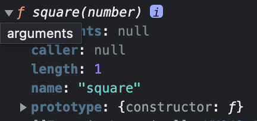

# 함수와 일급 객체

## 일급 객체

1. 무명의 리터럴로 생성할 수 있다. 런타임에 생성이 가능하다.
   1. 런타임 단계에 함수 리터럴이 평가되어 함수 객체가 생성되고 변수에 할당된다.
   2. 이러한 방식을 함수 표현식이라고 한다.
   3. 함수 선언식도 자바스크립트 엔진에 의해 함수 리터럴 방식으로 정의된다.
2. 변수나 자료구조(객체, 배열 등)에 저장할 수 있다.
3. 함수의 매개변수에 전달할 수 있다.
4. 함수의 반환값으로 사용할 수 있다.

자바스크립트의 함수는 일급 객체다.

함수를 객체와 동일하게 사용할 수 있다.

객체는 값이므로 함수는 값과 동일하게 취급할 수 있다.

즉 함수는 변수 할당문, 객체의 프로퍼티 값, 배열의 요소, 함수 호출의 인수, 함수 반환문 어디서든 리터럴로 정의할 수 있고 런타임에 함수 객체로 평가된다.

> 함수형 프로그래밍을 가능하게 하는 자바스크립트의 장점 중 하나

<aside>
💡 함수형 프로그래밍 : 순수 함수와 보조 함수의 조합을 통해 외부 상태를 변경하는 부수 효과를 최소화해서 불변성을 지향하는 프로그래밍 패러다임
로직 내의 조건문과 반복문을 제거해서 복잡성을 해결하고 변수 사용을 억제하거나 생명주기를 최소화해서 상태 변경을 피해 오류를 최소화하는 것을 목표로 한다.

순수 함수를 통해 부수 효과를 최대한 억제해 오류를 피하고 프로그램의 안정성을 높이려는 노력의 일환

</aside>

## 함수 객체의 프로퍼티

함수는 객체다.

```js
function square(number) {
  return number * number;
}

console.dir(square);
```



함수 객체의 데이터 프로퍼티 : length, name, arguments, caller, prototype

`__proto__`는 함수 객체 고유의 프로퍼티가 아니다.

`__proto__`는 Object.prototype 객체의 접근자 프로퍼티를 상속받는다.

### arguments 프로퍼티

함수 객체의 arguments 프로퍼티 값은 arguments 객체다.

arguments 객체는 함수 호출 시 전달된 인수들의 정보를 담고 있는 순회 가능한 유사 배열 객체

함수 내부에서 지역 변수처럼 사용되며 외부에서 참조할 수 없다.

함수를 정의할 때 선언한 매개변수는 함수 몸체 내부에서 변수와 동일하게 취급된다. (암묵적으로 undefined로 초기화된 후 인수가 할당된다.)

arguments 객체는 인수를 프로퍼티 값으로 소유하며, 프로퍼티 키는 인수의 순서를 나타낸다.

arguments 객체의 **caller** 프로퍼티는 호출되어 arguments 객체를 생성한 함수, 즉 함수 자신을 가리키고 arguments 객체의 **length** 프로퍼티는 인수의 개수를 가리킨다.

**arguments 객체의 Symbol(Symbol.iterator) 프로퍼티**

- arguments 객체를 순회 가능한 자료구조인 이터러블로 만들기 위한 프로퍼티
- `Symbol.iterator`를 프로퍼티 키로 사용한 메서드를 구현하는 것에 의해 이터러블이 된다.

> arguments 객체는 매개변수 개수를 확정할 수 없는 가변 인자 함수를 구현할 때 유용하다.

arguments 객체는 유사 배열 객체

- 이터레이션 프로토콜을 준수
- 이터러블
- 배열 메서드는 사용할 수 없다. 그러기 위해서는 Function.prototype.call, Function.prototype.apply 등을 간접 호출해야 한다.
  - `const array = Array.prototype.slice.call(arguments)`
  - 혹은 Rest 파라미터

### caller 프로퍼티

비표준 프로퍼티.

함수 자신을 호출한 함수를 가리킨다.

### length 프로퍼티

매개 변수의 개수

arguments 객체의 length(인자)와 함수 객체의 length(매개변수) 값은 다르다.

### name 프로퍼티

함수 이름

함수 이름과 함수 객체를 가리키는 식별자는 의미가 다르다.

### `__**proto__` 접근자 프로퍼티\*\*

모든 객체는 `[[Prototype]]` 이라는 내부 슬롯을 갖는다.

`[[Prototype]]` 내부 슬롯은 객체지향 프로그래밍의 상속을 구현하는 프로토타입 객체를 가리킨다.

`__proto__` 프로퍼티는 `[[Prototype]]` 내부 슬롯이 가리키는 프로토타입 객체에 간접적으로 접근하기 위해 사용하는 접근자 프로퍼티다.

```jsx
const obj = { a: 1 };
console.log(obj.__proto__ === Object.prototype); // true
// __proto__ 메서드는 Object.prototype의 메서드다.
console.log(obj.hasOwnProperty("__proto__")); // false
```

### prototype 프로퍼티

prototype 프로퍼티는 생성자 함수로 호출할 수 있는 함수, constructor만이 소유하는 프로퍼티다.
