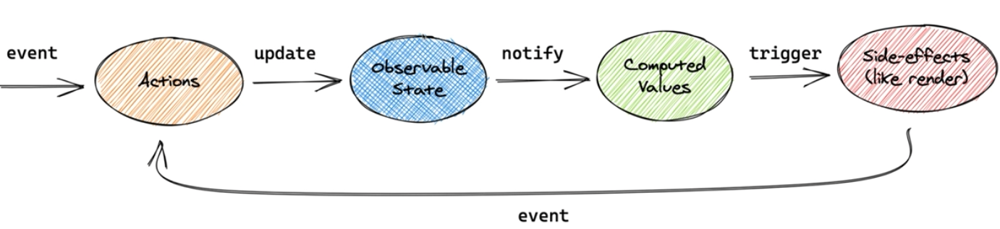

# mobx-start

reject 하고싶지않으때 사용할수 있는 패키지

```shell
  npm i customize-cra react-app-rewired -D
```

데코레이터 테스트용 dependency 주입
`npm i autobind-decorator`

타입스크립트 사용시 tsconfig파일에서 `experimentalDecorators` true로 설정하면 babel설정없이 사용가능다.

## @observable 관찰이 가능한 대상

> - observable(`<value>`)
>   - 데코레이터 없이 사용하는 방식
>   - @없이, 함수처러 사용해서 리턴한 객체를 사용
> - @observable <클래스의 프로퍼티>
>   - 데코레이터로 사용하는 법
>   - 클래스 내부에 프로퍼티 앞에 붙여서 사용
>   - 한 클래스 안에 여러개의 @observable존재

## observable방식과 @observable방식

```
// observable방식과
const isLogin = observable<any>(true)
const person = observable<any>({
    name: 'mark',
    age: 29,
  })

// @observable방식과
class PersonStore {
  @observable
  name = "Mark";

  @observable
  age = 39;
  constructor() {
    makeObservable(this);
  }
}

const personStore = new PersonStore();

autorun(() => {
  console.log(isLogin.get());
  console.log(person.name);
  console.log(personStore.age);
});
```

## @observer (by mobx-react)

의존성 주입 `npm i mobx-react`

> - observer(<컴포넌트>)
>   - 데코레이터 없이 사용하는 방식
>   - 함수 컴포넌트에 사용
> - <컴포넌트 클래스> 에 @observer 달아서 처리
>   - 클래스 컴포넌트에 사용

observer들이 변경되었을때 observer처리된 컴포넌트들이 다시 랜더링 된다.

context 사용한 props 주입

```ts
//context
import { createContext } from 'react'

const PersonContext = createContext<any>({ age: 0, name: '' })

export default PersonContext
```

```ts
// store
import { makeObservable, observable } from 'mobx'

export default class PersonStore {
  @observable
  name = 'Mark'

  @observable
  age = 39
  constructor() {
    makeObservable(this)
  }

  plus() {
    this.age++
  }
}
```

```ts
// function component
function App() {
  function click() {
    personStore.plus()
  }
  const personStore = useContext(PersonContext)
  return (
    <div className="App">
      <header className="App-header">
        <Button />
        <p> {personStore.age}</p>
        <p>
          <button onClick={click}>plus</button>
        </p>
      </header>
    </div>
  )
}

export default observer(App)
```

```ts
// class component
@observer
class App extends React.Component {
  static contextType = PersonContext
  @autobind
  click() {
    const personStore = this.context
    personStore.plus()
  }

  render() {
    const personStore = this.context
    return (
      <div className="App">
        <header className="App-header">
          <Button />
          <p> {personStore.age}</p>
          <p>
            <button onClick={this.click}>plus</button>
          </p>
        </header>
      </div>
    )
  }
}

export default App
```

mobx-react에서 제공하는 provider를사용한 방법해보자!

## computed (by mobx)


먼가 변경이 일어났을때 observable state를 바로 render해서 사용하는 것이아니고
computed라고 하는 렌더에 변경을 일으키는 항목으로 notify 시키고 컴포넌트에서는 computed의 상태만 변경되었을때 렌더를 다시하는 방향으로 observable의 모든 state변경에 반응하지 않고 computed상태를 중간단계를 두어 처리하는 일종의 캐싱형태의 단계이다.

> - computed(내부에서 observable을 사용하는 함수);
>   - 데코레이터 없이 사용하는 방식
> - <observable클래스>dml getter에 @computed 달아서 처리
>   - 스토어에 사용
>   - getter에만 붙일수 있다.
> - 함수가 아니라 리액티브 하다는 것에 주목
> - 실제 컴포넌트에서 사요하는 (getter)값들에 달아서 사용하면 최소범위로 변경할수 있기 때문에 유용.
>   - 40살이 넘었을때만 나이를 올리면 40살 이하일때는 재랜더링 대상이 아닌 것과 같은 경우
>   - 내부적으로 고도의 최적화 => 어떻게?
>     - 매번 재계산을 하지 않는다.
>     - 계산에 사용할 observable 값이 변경되지 않으면 재실행하지 않음.
>     - 다른 computed 또는 reaction에 의해 호출되지 않으면 재실행하지 않음
>     - observable이 변했는데 computed가 변하지 않을때 렌더하지 않음

=> computed에 의해 변경이 있을 경우만 render가 발생한다.

### computed를 함수로 사용하는 방법

useMemo와 같이 비슷해보인다. observable을 직접 observer하지 않고 computed를 보여지는 방식으로 설계하는 것이 좋을것같다.

```js
const age10 = computed(() => {
  return Math.floor(personStore.age / 10) * 10
}).get()
console.log('render')
```

### 데코레이터를 활용한 computed 활용

```js
  @computed
  get age10() {
    return Math.floor(this.age / 10) * 10;
  }
```

## @action (by mobx)

action 이란 observable state를 업데이트 시키는 요인이된다.
redux의 action과 같다고 할수 있다.
observable의 proxy라는 패턴이 적용되어 있었기 때문에 action을 사용하지 않았지만 observable의 state를 업데이트 할 수 있었다.
Why? action을 사용해야하는지 알아보자!

```js
function click() {
  // personStore.plus();
  setTimeout(() => {
    personStore.age = '45'
    personStore.name = 'southkyu'
  }, 500)
}
```

console 확인해보면 render 45 Mark > render 45 southkyu 두번의 render가 발생하게된다. `personStore.age = '45'personStore.name = 'southkyu'` 해당 부분을 일종의 transaction처리를 해주어야한다. mobx에서는 여러가지 방법중 action을 이용한 방법으로 감싸주는 방법이 있다.

- 1. action을 이용하는 방법 중 감싸주는 방법

```js
function click() {
  setTimeout(
    action(() => {
      //새로운 함수생성 생성된 함수가 리턴
      personStore.age = '45'
      personStore.name = 'southkyu'
    }),
    500
  )
}
```

- 2. 함수로 생성하지않고 바로 `runInAction`으로 실행하는 방법

```js
function click() {
  setTimeout(() => {
    runInAction(() => {
      personStore.age = '45'
      personStore.name = 'southkyu'
    })
  }, 500)
}
```

- 3. 데코레이터로 로직을 처리

```js
//store
@action
  testAction() {
    this.age = 45;
    this.name = "southkyu";
  }
```

## @inject와 Provider

react와 mobx를 이어주는 데코레이터

컨테이너라는 개념을 사용해도 좋다.
provider에 props로 넣고, @inject로 꺼내 사용한다고 생각하면된다.
명시적이고 편리함, 컨테이너를 쓰지 않아도 될것 같지만 테스트 분리를 위해 사용권장

mobx-react에서 가져온 inject로 감싸고 실행시켜준다. provider에 props로 지정된 것을 문자열로 꺼내올수 있다.

```js
export default inject('personStore')(observer(App))
```

이제 context로 받아오던것을 props로 받아올수 있다. 이렇게 사용가능한것은 mobx의 여러개의 store를 가질 수 있다는 특징 때문이다.

container컴포넌트를 만들어서 Presentational 컴포넌트에 props로 넣어주는 방식으로 작업을 해야지 Presentational(app)컴포넌트는 container컴포넌트 로직에 영향없이 비주얼 컴포넌트로 테스트하고 관리할수 있게 된다.

```js
@inject('personStore')
@observer
class AppContainer extends React.Component<any> {
  render() {
    const { personStore }: any = this.props

    return <App age10={personStore.age10} plus={this.click} />
  }

  @autobind
  click() {
    this.props.personStore.plus()
  }
}

function App({ age10, plus }: any) {
  return (
    <div className="App">
      <header className="App-header">
        <Button />
        <p> {age10}</p>
        <p>
          <button onClick={click}>plus</button>
        </p>
      </header>
    </div>
  )
  function click() {
    plus()
  }
}
export default AppContainer
```

## store

여러개의 store를 사용하는 방법
rootStore를 설정 후 각각의 store에 this를 주입하여
다른 store에 접근 가능하다.

```js
export default class RootStore {
  todoStore: TodoStore
  personStore: PersonStore
  constructor() {
    this.todoStore = new TodoStore(this)
    this.personStore = new PersonStore(this)
  }
}
```

## Asynchronous actions 비동기 액션처리 알아보기

1. action을 비동기 로직으로 만들지말고 각각 state를 변하는 action을 따로따로 만든 후 비동기로직은 container에서 구현하고 단계별로 state를 변경하는 action은 별도로 분리하여 호출하는 방법

```js
const UserListContainer = ({ userStore }: any) => {
  const getUsers = useCallback(async () => {
    try {
      userStore.pending()
      const res = await axios.get('https://api.github.com/users')
      console.log(res)
      userStore.success(res.data)
    } catch (error) {
      userStore.fail(error)
    }
  }, [userStore])
  const { users } = userStore.state
  return <UserList getUsers={getUsers} users={users} />
}

export default inject('userStore')(observer(UserListContainer))
```

2. action안에서 async await로직을 실행하면서 state를 변경하려고 할때 runInAction을 활용해서 타이밍마다 state를 변겨하는 방법

```js
// store에서 작성
async getUsers() {
    try {
      runInAction(() => {
        this.state.loading = true;
        this.state.error = null;
      });
      const res = await axios.get("https://api.github.com/users");
      runInAction(() => {
        this.state.users = res.data;
        this.state.loading = false;
        this.state.error = null;
      });
    } catch (error) {
      runInAction(() => {
        this.state.loading = false;
        this.state.error = error;
      });
    }
  }
```

3. mobx에서 제공하는 generator를 사용하여 비동기로직을 처리하는 방법

```js
@flow
  *getUsersFlow() {
    try {
      this.state.loading = true;
      this.state.error = null;
      const res = yield axios.get("https://api.github.com/users");
      this.state.users = res.data;
      this.state.loading = false;
      this.state.error = null;
    } catch (error) {
      this.state.loading = false;
      this.state.error = error;
    }
  }
```
