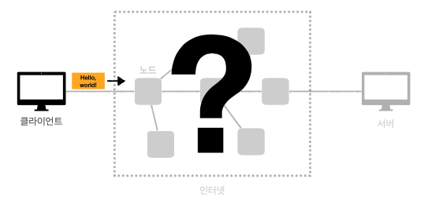
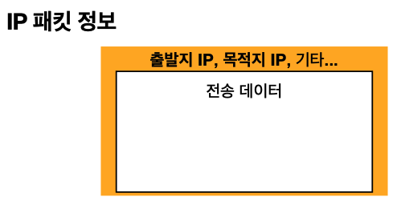
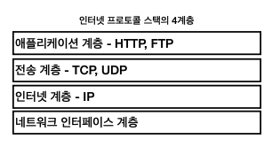
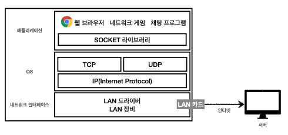
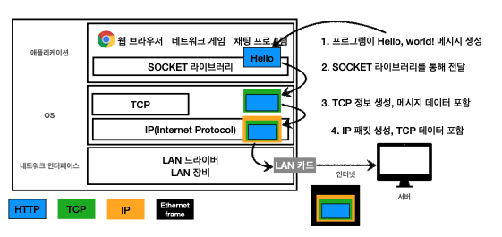
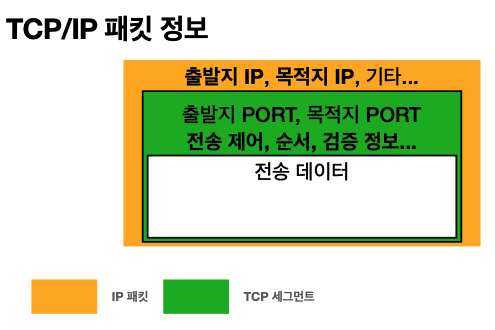
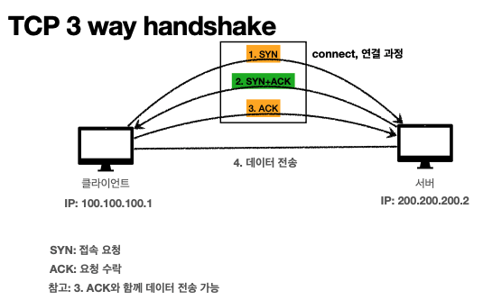

# [HTTP] 1. 인터넷과 네트워크

[인터넷 네트워크]

- 인터넷 통신
- IP(Internet Protocol)
- TCP, UDP
- PORT
- DNS

## 1. 인터넷 통신

인터넷에서 컴퓨터 둘은 어떻게 통신할까??

클라이언트와 서버가 바로 붙어 있다면 연결한 케이블로 전달 받으면된다. 하지만 클라이언트와 서버가 멀리 있다면 인터넷 망을 통해 데이터를 보내야 한다. 중간 서버를 거쳐 메세지가 안전하게 가야한다. 어떤 규칙으로 어떻게 넘어갈까? 이를 알기 위해서는 **IP(인터넷 프로토콜)**에 대해 알아야 한다.

## 2. IP(Internet Protocol)

IP 인터넷 프로토콜의 역할

- 지정한 IP주소(IP Address)에 데이터 전달
- 패킷(Packet)이라는 통신 단위로 데이터 전달

최소한의 규칙인 IP 주소를 통해 가능하다. 먼저 클라이언트가 IP주소를 제공받고 서버도 IP주소도 제공받아야 한다. 메세지를 그냥 보내는 것이 아니라 IP패킷이라는 규칙을 통해 전송한다.

IP패킷 정보를 만든 후 IP프로토콜에 의해서 출발지 목적지 IP를 노드에서 찾아 해당 IP주소를 가진 서버에 도달하게 된다.

IP프로토콜의 한계

- 비연결성
  - 패킷을 받을 대상이 없거나 서비스 불능 상태여도 패킷 전송
  - (서버가 꺼져있는 상황) 클라이언트는 대상서버가 패킷을 받을 수 있는 상태인지 모름
- 비신뢰성
  - 중간에 패킷이 사라지면?
  - 패킷이 순서대로 안오면?
- 프로그램 구분
  - 같은 IP를 사용하는 서버에서 통신하는 애플리케이션이 둘 이상이라면?

IP프로토콜은 비연결성, 비신뢰성, 패킷 전달 순서 문제 발생(패킷크기로인한) 이러한 한계로 TCP프로토콜이 등장한다.

## 3. TCP, UDP 프로토콜

프로토콜 계층

소켓라이브러를 통해 OS계층에 hello, world를 전달 TCP정보생성 IP패킷을 생성 랜카드를 통해 나갈때 이더넷프레임을 통해 LAN카드로 전달

IP패킷에 출발지 IP, 목적지 IP를 전달하고 TCP패킷에 출발지 PORT, 목적지 PORT, 전송제어, 순서 등을 담아 전송한다.

TCP특징

전송제어프로토콜(Transmission Control Protocol)

- 연결지향 - TCP 3 way handshake(가상연결)
  **연결된 여부를 확인 후 데이터를 전달( IP프로토콜의 문제점 극복)**
- 데이터 전달 보증 **(패킷이 중간에 누락된 여부를 알수있음)**
- 순서 보장
- 신뢰할수 있는 프로토콜
- 현재는 대부분 어플리케이션에서 TCP 사용

TCP 3 way handshake

1. 클라이언트에서 서버로 SYN 메세지를 보내고
2. 서버에서는 ACK라는 메세지를 클라이언트로 보내면서 서버도 연결 요청(SYN)
3. 클라이언트도 ACK를 보낸다.

3 way handshake는 클라이언트도 서버를 믿을수 있고 서버도 클라이언트를 믿을수 있다. 연결된 것을 인식하게 되므로 그다음 데이터를 전송한다. 논리적인 연결이다.

데이터 전달 보증

데이터 전송 서버에서 데이터 잘받았는지 응답

순서보장

패킷을 1,2,3 순서로 전송 시 서버에서 패킷이 1,3,2 순서로 도착시 패킷 2부터 다시 보내도록 서버에서 클라이언트로 요청한다.

전송제어, 순서, 검증정보가 TCP 패킷내에 존재하므로 TCP는 신뢰할수 있는 프로토콜이라고 부른다.

UDP

- 하얀 도화지에 비유(기능이 거의 없음)
- 연결지향 - TCP 3 way handshake X
- 데이터 전달 보증 X
- 순서 보장 X
- 데이터 전달 및 순서가 보장되지 않지만, 단순하고 빠름
- 정리
  - IP와 거의 같다. + PORT + 체크섬 정도만 추가
  - 애플리케이션에서 추가 작업 필요

## 4. PORT

한번에 둘 이상을 연결해야 하면?

클라이언트에서 게임, 화상통화, 웹브라우저 요청 등 여러개의 서버와 통신해야할때 패킷들이 IP로 전달될때 어떻게 구분할지 구분해야한다.

같은 IP내에서 프로세스를 구분하는것이 PORT이다.

0 ~ 65536 할당가능

0 ~ 1023: 잘알려진 포트, 사용하지 않는것이 좋다.

- FTP - 20, 21
- TELNET - 23
- HTTP - 80
- HTTPS - 443

## 5. DNS(Domain Name System)

IP는 기억하기 어렵고, 변경되는 단점이 있다.

DNS서버에 IP주소를 등록하여 도메인으로 접근가능하다.
