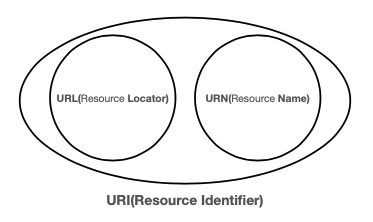
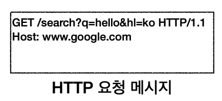
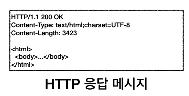

# [HTTP] 2. URI와 웹브라우저 요청 흐름

[URI와 웹브라우저 요청 흐름]

- URI
- 웹 브라우저 요청 흐름

## 1. URI(Uniform Resource Identifier)

URI? URL? URN?

`“URI는 로케이터(locator), 이름(name)또는 둘다 추가로 분류될 수 있다.”`

- URI - 리소스를 식별(자원을 식별하는 방법)
- URL - 리소스의 위치
- URN - 리소스의 이름

URL 전체문법

- scheme://[userInfo@]host[:port][/path][?query][#fragment]

scheme

- 주로 프로토콜 사용
- 프로토콜 : 어떤 방식으로 자원에 접근할 것인가 하는 약속 규칙
  ex) http, https, ftp 등등
- http는 80포트, https는 443포트를 주로 사용, 포트는 생략가능

path

- 리소스 경로(path), 계층적 구조

## 1. 웹 브라우저 요청 흐름

`https://www.google.com/search?q=hello&hl=ko`

- DNS서버를 조회하고 IP를 알아고 포트정보는 https로 443 찾아낸다
- HTTP요청 메세지를 생성한다.

- HTTP 메시지 전송
  - 웹브라우저가 http 메시지 생성
  - SOCKET 라이브러리 통해 TCP/IP 연결 후 데이터 전달
  - TCP/IP 패킷 생성, HTTP메시지 포함
- 요청 패킷 생성
- 웹브라우저가 요청 패킷 전달
- 서버가 요청 패킷 도착 후 HTTP 응답 패킷 전달

- 웹브라우저에서 응답 패킷 도착 후 HTML 렌더링
