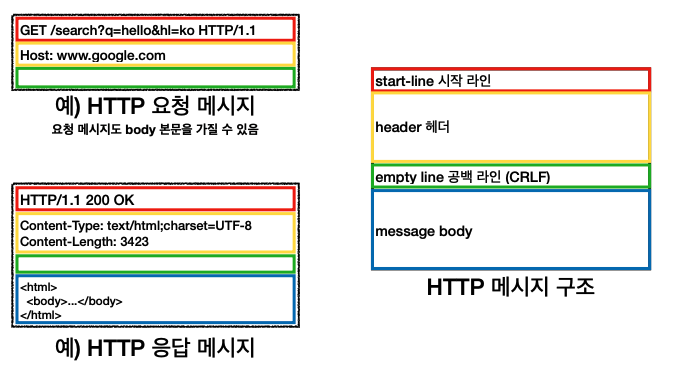
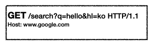
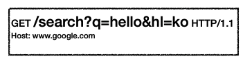
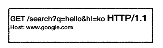
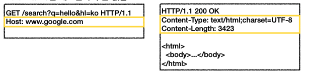

# [HTTP] 3. HTTP 기본

[HTTP 기본]

- 모든것이 HTTP
- 클라이언트 서버 구조
- Stateful, Stateless
- 비연결성(connectionless)
- HTTP메시지

## 1. 모든것이 HTTP (HyperText Transfer Protocol)

HTTP 메시지에 모든것을 전송

- HTML, TEXT
- IMAGE, 음성, 영상, 파일
- JSON, XML (API)
- 거의 모든 형태의 데이터 전송 가능
- 서버간에 데이터를 주고 받을때도 대부분 HTTP 사용

HTTP의 역사

- HTTP/0.9 1991년: GET 메소드만 지원, HTTP헤더 X
- HTTP/1.0 1996년: 메서드, 헤더 추가
- HTTP/1.1 1997년: 가장많이 사용, 우리에게 가장 중요한 버전
- HTTP/2 2015년: 성능 개선
- HTTP/3 진행중: TCP대신에 UDP사용, 성능개선

기반 프로토콜

- TCP: HTTP/1.1, HTTP/2
- UDP: HTTP

HTTP 특징

- 클라이언트 서버 구조
- 무상태 프로토콜(스테이리스), 비연결성
- HTTP 메시지를 통해 통신
- 단순함, 확장 가능

## 2. 클라이언트 서버 구조

`http는 클라이언트 서버 구조이다.`

http는 클라이언트가 http 메시지를 통해 서버에 요청을 보내고 클라이언트는 서버에 응답이 올때까지 기다린다. 서버가 요청에 대한 결과를 만들어서 응답이 오면 응답 결과를 열어 클라이언트가 동작하게 된다.

- Request Response 구조
- 클라이언트는 서버에 요청을 보내고 응답을 대기
- 서버가 요청에 대한 결과를 만들어서 응답

분리된 이유는 무엇인가?

⇒ 비지니스 로직이랑 데이터는 서버에 넣고 클라이언트는 사용성 UI에 집중하므로 클라이언트와 서버가 각각 독립적으로 진화가 가능하다.

## 3. Stateful, Stateless 무상태 프로토콜

`http의 중요한 특징 중 하나는 무상태 프로토콜을 지향한다!!(stateless)`

⇒ 즉, 서버가 클라이언트의 상태를 보존하지 않는다.

Stateful, Stateless의 차이

Stateful - 상태 유지

Stateless - 무상태

Stateless 한계

- 모든 것을 무상태로 설계할수 있는 경우도 있고 없는 경우도 있다.
- 무상태 ( 로그인이 필요 없는 단순한 서비스 소개 화면)
- 상태 유지 ( 로그인)
- 로그인한 사용자의 경우 로그인 했다는 상태를 서버에 유지
- 일반적으로 브라우저 쿠키와 서버 세션등을 사용해서 상태 유지

데이터를 많이 보낸다.

## 3. 비연결성

연결을 유지하는 모델

TCP/IP연결 같은 경우는 기본적으로 연결을 유지한다. 클라이언트1이 요청을 보내고 응답을 받으면 연결이 유지가 되고 클라이언트가 요청을 보내고 응답을 받는과정에서 클라이언트1은 접속이 유지된 상태이다. 이러한 과정동안 연결이 유지하는 서버의 자원이 소모된다.

→ 서버는 연결을 계속 유지, 서버자원 소모

연결을 유지하지 않는 모델

클라이언트1이 요청을 보내고 응답을 보내면 연결을 유지하지 않는다.

→ 서버 입장에서 자원을 요청을 주고 받을때만 사용하므로 최소한의 자원을 사용한다.

- `HTTP는 기본적으로 연결을 유지하지 않는 모델이다.`
- 일반적으로 초단위의 이하의 빠른 속도로 응답
- 1시간 동안 수천명이 서비스를 사용해도 실제 서버에서 동시에 처리하는 요청은 수십개 이하로 매우 작다.
  - 예) 웹 브라우저에서 계속 연속해서 검색 버튼을 누르지 않는다.
- 서버 자원을 매우 효율적으로 사용할 수 있음

한계와 극복

- TCP/IP 연결을 새로 맺어야 한다 - 3 way handshake 시간 추가 (SYN / ACK time)
- 웹브라우저로 사이트를 요청하면 HTML 뿐만아니라 css, 이미지 등 수많은 자원이 다운로드 됨
- 지금은 HTTP 지속 연결로 문제 해결

## 4. HTTP 메시지

HTTP 메시지 구조

시작라인 / 헤더 / 공백라인(CRLF) / body 로 구분된다.

### 시작라인

1. **요청메시지**

- start-line = **request-line** / status-line 두가지로 구분
- request-line(요청라인) = method SP (공백) request-target(Path) SP HTTP-version CRLF(엔터)

요청메시지 - HTTP 메서드

- 종류 : GET, POST, PUT, DELETE
- 서버가 수행해야 할 동작 지정
  - GET : 리소스 조회
  - POST : 요청 내역 처리

요청메시지 - 요청 대상 절대경로 시작한다.

요청메시지 - HTTP 버전

1. **응답 메시지**

- start-line = request-line / **status-line**
- status-line = HTTP-version SP status-code SP reason-phrase CRLF

- HTTP 버전
- HTTP 상태코드 : 요청 성공 실패를 나타냄
  - 200 : 성공
  - 400 : 클라이언트 요청 오류
  - 500 : 서버 내부 오류

### HTTP 헤더

- header-field = field-name “:” OWS field-value OWS (OWS: 띄어쓰기 허용)

- HTTP 전송에 필요한 모든 부가정보
- 예) 메시지 바디의 내용, 메시지 바디의 크기, 압축, 인증, 요청 클라이언트(브라우저) 정보, 서버 어플리케이션 정보, 캐시관리정보…
- 표준 헤더가 너무 많음
- 필요시 임의의 헤더 추가 가능

### HTTP 메시지 바디

- 실제 전송할 데이터
- HTML 문서, 이미지, 영상, JSON 등 byte로 표현할 수 있는 모든 데이터 전송가능
