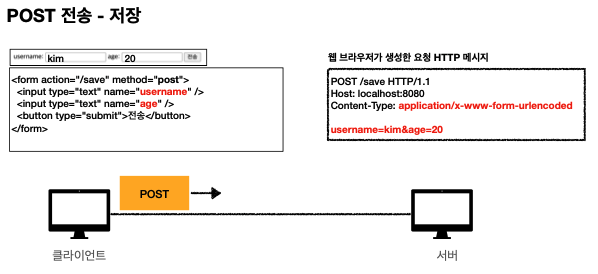
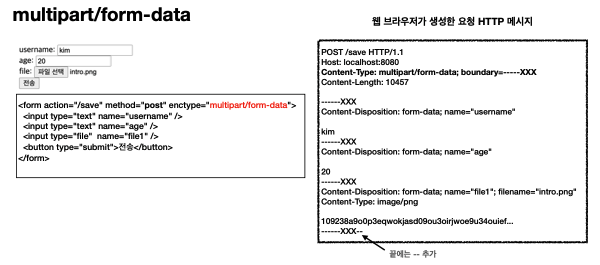
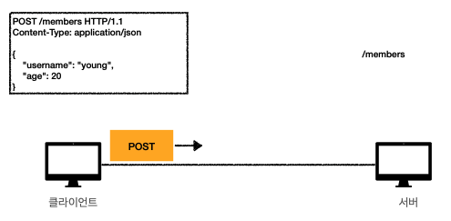

# [HTTP] 5. HTTP메서드 활용

- 클라이언트에서 서버로 데이터 전송
- HTTP API 설계 예시

## 클라이언트에서 서버로 데이터 전송

데이터 전달 방식은 크게 2가지

**쿼리 파라미터를 통한 데이터 전송**

- GET
- 주로 정렬 필터(검색어)

**메시지 바디를 통한 데이터 전송**

- POST, PUT, PATCH
- 회원가입, 상품주문, 리소스등록, 리소스 변경

4가지 상황

**정적데이터조회**

- 이미지, 정적 텍스트 문서
- 쿼리 파라미터 미사용
- 조회는 GET 사용, 정적데이터는 일반적으로 쿼리 파라미터 없이 리소스 경로로 단순한게 조회 가능

**동적데이터 조회**

- 검색, 게시판 목록에서 정렬 필터(검색어)
- 쿼리 파라미터 사용 (추가데이터를 전달할때)
- 조회 조건을 줄여주는 필터, 조회 결과를 정렬하는 정렬 조건에 주로 사용

**HTML Form을 통한 데이터 전송** - 회원가입, 상품 주문, 데이터 변경

<Form /> 태그로 회원가입 폼음 만듬 action=”/save” method=”post”  를 서버에 전송하여 회원을 등록하고 싶다면 웹브라우저가 폼의 데이터를 읽어서 HTTP메서드를 읽어서 생성해주는 역할을 한다. Content-Type: `application/x-www-form-urlencoded` username=Kim&age=20 쿼리파라미터와 유사한형태로 key/value 스타일로 데이터를 만들어 HTTP `body`에 넣는다(POST이기떄문) - 클라이언트와 서버간의 약속

GET 으로 전송 하게되면 url 경로에 쿼리파라미터가 생성되므로 사용하면 안됨!

FILE전송 타입

enctype을 multipart/form-data를 통해 파일전송을 한다.Content-type의 default는 `application/x-www-form-urlencoded` 이다. 바이트로 되어있는 파일까지 같이 전송시에는 메세지 바디에 넣는 데이터 형식을

사용해야한다. Content-Type은 `multipart/form-data` 로 들어가고 `boundary` 들어가서 `boundary`로 통해 자르게된다.

정리

- HTML Form Submit 시 POST전송
  - 회원가입, 상품주문, 데이터 변경
- Content-Type: application/x-www-form-urlencoded사용
  - form의 내용을 메시지 바디를 통해서 전송(key=value, 쿼리 파라미터 형식)
  - 전송 데이터를 url encoding처리 ex) abc김 ⇒ abc%EA%B9%80
- HTML Form은 GET 전송도 가능하나 저장시에는 사용하지 않음
- Content-Type: multipart/form-data
  - 파일 업로드 같은 바이너리 데이터 전송시 사용
  - 다른 종류의 여러 파일과 폼의 내용 함께 전송 가능

**HTML API를 통한 데이터 전송** - 회원가입, 상품주문, 데이터변경, 서버 to 서버, app client, web client(ajax)

클라이언트에서 서버로 데이터를 바로 전송할때 HTTP api로 바로 전송한다고 하는데 만들어서 사용

- 서버 to 서버
  - 백엔드 시스템 통신
- 앱클라이언트
  - 아이폰, 안드로이드
- 웹 클라이언트
  - HTML에서 Form 전송 대신 자바스크립트를 통한 통신에 사용(AJAX)
  - React 웹 클라이언트와 API통신
- POST, PUT, PATCH: 메시지 바디를 통해 데이터 전송
- GET: 조회, 쿼리 파라미터로 데이터 전달
- Content-Type: application/json을 주로 사용

## HTTP API 설계 예시

- HTTP API - 컬렌션
  - POST기반 등록
  - 회원 관리 API 제공
- HTTP API - tmxhdj
  - PUT기반 등록
  - Ex) 정적 컨텐츠 관리, 원격 파일 관리
- HTML FORM 사용
  - 웹 페이지 회원 관리
  - GET, POST 만 지원

`요청시 URI를 서버에서 만들어준다!` 클라이언트는 등록될 리소스 URI를 모른다.

컬렉션 - POST기반 저장

- 서버가 관리하는 리소스 디렉토리
- 서버가 리소의 URI를 생성하고 관리
- 여기서 컬렌셕은 /members

PUT - 신규 자원등록 특징

- 클라이언트가 리소스 URI를 알고 있어야 한다.
  - 파일등록 /files/{filename} → PUT
  - PUT /files/star/jpg
- 클라이언트가 직접 리소스의 URI를 지정한다.
- 스토어
  - 클라이언트가 관리하는 리소스 저장소
  - 클라이언트가 리소스의 URI를 알고 관리
