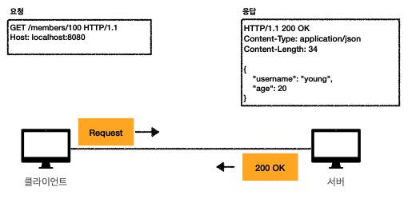
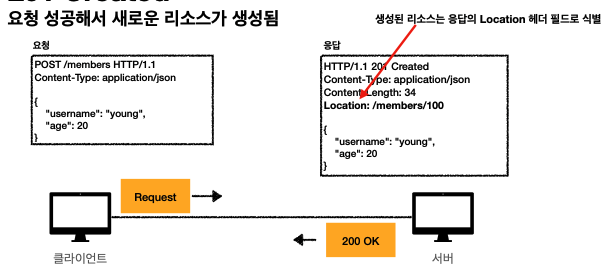
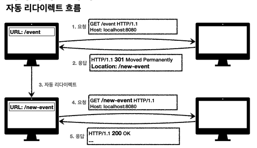
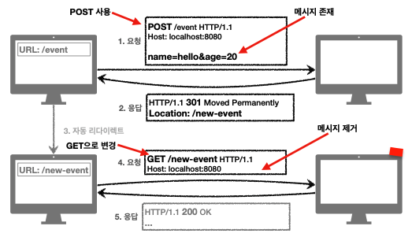
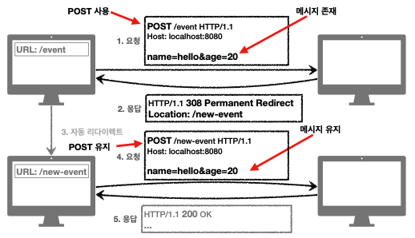
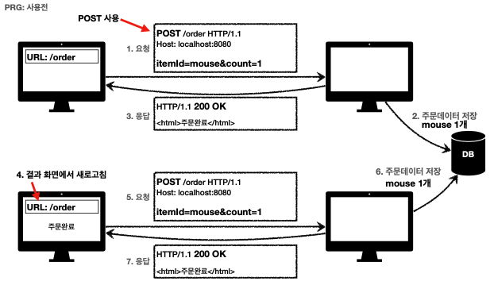
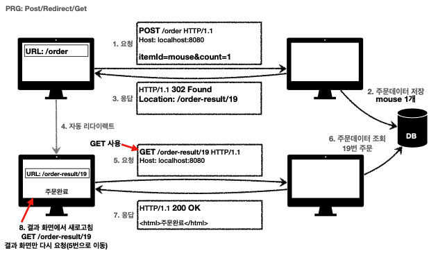

# [HTTP] 6. HTTP상태코드

## 상태코드

클라이언트가 보낸 요청의 처리 상태를 응답에서 알려주는 기능

- 1xx(Informational): 요청이 수신되어 처리중
- 2xx(Successful): 요청 정상 처리
- 3xx(Redirection): 요청을 완료하려면 추가 행동이 필요
- 4xx(Client Error): 클라이언트 오류, 잘못된 문법등으로 서버가 요청을 수행할수 없음
- 5xx(Server Error): 서버 오류, 서버가 정상 요청을 처리하지 못함

만약 클라이언트가 모르는 상태코드가 나타나면 상위 상태코드로 해석하여 처리

### 2xx - 성공

클라이언트가 보낸 요청이 성공적으로 처리

- 200 OK

- 201 Created

- 202 Accepted
  요청이 접수되었으나 처리가 완료되지 않았음 - 배치 처리 같은 곳에서 사용 (잘사용하진않음)
- 204 No Content
  서버가 요청을 성공적으로 수행했지만, 응답 페이로드 본문에 보낼 데이터가 없음 - ex) 웹 문서 편집기에서 save 버튼 - save 버튼의 결과로 아무 내용이 없어도 된다. - save버튼을 눌러도 같은 화면을 유지해야 한다. - 결과 내용이 없어도 204메시지(2xx)만으로 성공을 인식할 수 있다.

### 3xx - 리다이렉션

요청을 완료하기 위해 유저 에이전트의 추가 조치 필요

> 리다이렉션의 이해 : 웹브라우저는 3xx 응답의 결과에 Location 헤더가 있으면, Location 위치로 자동 이동한다.

리다이렉션의 종류

- 영구 리다이렉션 - 특정 리소스의 URI가 영구적으로 이동
- 일시 리다이렉션 - 일시적인 변경
  - 주문 완료 후 주문 내역 화면으로 이동 PRG: Post/Redirect/Get
- 특수 리다이렉션
  - 결과 대신 캐시를 사용

### 영구 리다이렉션 301, 308

- 리소스의 URI가 영구적으로 이동
- 원래의 URL을 사용X, 검색엔진 등에서도 변경 인지
- 301 Moved Permanently
  - 리다이렉트시 요청 메서드가 GET으로 변하고, 본문이 제거될 수 있음(May)
    
- 308 Permanent Redirect
  - 301과 기능은 같음
  - 리다이렉트시 요청 메서드와 본문유지(처음 POST를 보내면 리다이렉트도 POST유지)
    

### 일시적인 리다이렉션 302, 307, 303

- 리소스의 URI가 일시적으로 변경
- 따라서 검색 엔진 등에서 URL을 변경하면 안됨
- 302 Found
  - 리다이렉트 시 요청 메서드가 GET으로 변하고 본문이 제거될수 있음
- 307 Temporary Redirect
  - 302와 기능은 같음
  - 리다이렉트시 요청 메서드와 본문 유지(요청 메서드를 변경하면 안된다 MUST NOT)
- 303 See Other
  - 302와 기능은 같음
  - 리다이렉트시 요청 메서드가 GET으로 변경

### PRG: Post/Redirect/Get

일시적인 리다이렉션 - 예시

적용전

- POST로 주문후에 웹 브라우저를 새로고침하면?
- 새로고침은 다시 요청
- 중복 주문이 될수 있다.

상품 주문하기 POST 요청 서버가 주문데이터 저장 200 OK 응답 주문완료가됨

결과 화면에서 새로고침 하면 POST요청이 클라이언트 서버로 새로 보냄 주문데이터가 1건 새로 들어옴 클라이언트는 새로고침하면 주문이 계속 쌓임 서버에서 해결하는게 원칙

적용 후

- POST로 주문후에 새로 고침으로 인한 중복 주문 방지
- POST로 주문후에 주문 결과 화면을 GET 메서드로 리다이렉트
- 새로고침해도 결과 화면을 GET으로 조회
- 중복 주문 대신에 결과 화면만 GET으로 다시 요청

폼에 요청이 가면 데이터베이스에 저장되고 응답을 302Found를 주거나 303으로 주면 Location을 준다. 클라이언트가 300시리즈의 Location을 인지하고 GET으로 변경 19번 주문정보를 조회 고객이 새로고침해도 GET으로 결과 화면만 다시 요청 된다.

`⇒ 사용자입장에서 사용성이 좋다`

> 302 Found → GET으로 변할수 있음
> 307 Temporary Redirect → 메서드가 변하면 안됨
> 303 See Other → 메서드가 GET으로 변경

### 기타 리다이렉션 300, 304

300은 안씀

- 304 Not Modified
  - 캐시를 목적으로 사용
  - 클라이언트에게 리소스가 수정되지 않았음을 알려준다. 따라서 클라이언트는 로컬 PC에 저장된 캐시를 재사용한다. (캐시로 리다이렉트한다.)
  - 304응답은 응답에 메시지 바디를 포함하면 안된다. (로컬 캐시를 사용해야 하므로)

### 4xx(Client Error) 클라이언트 에러

- 클라이언트의 요청에 잘못된 문법등으로 서버가 요청을 수행할수 없음
- 오류의 원인이 클라이언트에 있음
- 중요! 클라이언트가 이미 잘못된 요청, 데이터를 보내고 있기 때문에, 똑같은 재 시도가 실패함

**400 Bad Request 클라이언트가 잘못된 요청을 해서 서버가 요청을 처리할수 없음**

**401 Unauthorized 클라이언트가 해당 리소스에 대한 인증이 필요함**

- 401 오류 발생시 응답에 WWW-Authenticate 헤더와 함께 인증 방법을 설명
- 인증(Authentication) : 본인이 누구인지 확인, (로그인)
- 인가(Authorization): 권한부여(ADMIN 권한처럼 특정 리소스에 접근할 수 있는 권한, 인증이 있어야 인가가 있음)

**403 Forbidden 서버가 요청을 이해했지만 승인을 거부함 - 접근 권한이 없는것**

**404 Not Found 요청 리소스를 찾을수 없음**

### 5xx (Server Error) - 서버 오류

- 서버 문제로 오류 발생

**500 Internal Server Error 서버 내부 문제로 오류 발생**

**503 Service Unavailable 서비스 이용 불가**
