# [HTTP] 7. 헤더1 - 일반 헤더

## HTTP 헤더 개요

HTTP헤더는 HTTP전송에 필요한 모든 부가정보가 들어가고 표준 헤더가 너무 많음.

RFC723x 변화로 엔티티 → 표현 | 표현 = 표현 메타데이터 + 표현 데이터

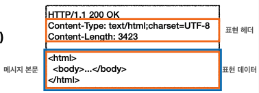
HTTP BODY

메세지 본문을 통해 표현 데이터 전달

메세지 본문 = 페이로드

표현은 요청이나 응답에서 전달할 실제 데이터

표현 헤더는 표현데이터를 해석할 수 있는 정보 제공

- 데이터 유형, 데이터 길이, 압축 정보

### 표현 - 표현 헤더는 전송과 응답 둘다 사용

- **Content-Type : 표현 데이터의 형식**
  - 컨텐트 바디의 타입이 무엇인지 데이터 형식 설명
    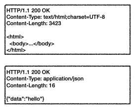
- **Content-Encoding: 표현 데이터의 압축 방식**
  - 표현 데이터를 압축하기 위해 사용
  - 데이터를 전달하는 곳에서 압축 후 인코딩 헤더 추가
  - 데이터를 읽는 쪽에서 인코딩 헤더의 정보로 압축 해제
    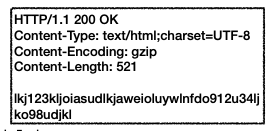
- **Content-Language: 표현 데이터의 자연 언어**
  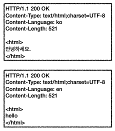
- **Content-Length: 표현 데이터의 길이**
  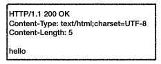

### 협상(콘텐츠 네고시에이션)

클라이언트가 선호하는 표현 요청

- **Accept: 클라이언트가 선호하는 미디어 타입 전달**
- **Accept-Charset: 클라이언트가 선호하는 문자 인코딩**
- **Accept-Encoding: 클라이언트가 선호하는 압축 인코딩**
- **Accept-Language: 클라이언트가 선호하는 자연언어**

Accept-Language 적용 전 클라이언트가 한국어 인지 정보가 없으면 기본 디폴트 영어로 응답을 한다

Accept-Language 적용 후 클라이언트가 서버로 보낼때 Accept-Language를 ko로 요청한다면 서버는 한국어로 응답해준다.

협상과 우선순위

Quality Values(q) 값 사용

0~1, 클수록 높은 우선순위

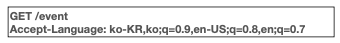

구체적인 것이 우선한다.

### 전송방식

- 단순 전송 : 컨텐츠 길이값을 단순하게 요청하고 한번에 응답 받음
- 압축 전송 : 서버에서 압축하고 Content-Encoding으로 압축한 형식을 응답해줌.
- 분할 전송 : Transfer-Encoding 에 chunked 를 보낸다. 분할해서 전송한다. 분할 전송일 때는 Content-Length를 보내면안된다.
- 범위 전송 : 이미지를 받을때 중간에 끊겼을때 처음부터 받지않고 중간에 끊긴 부분부터 다운 받음.

### 일반 정보

**From**(유저 에이전트의 이메일 정보) : 일반전으로 잘 사용되지 않음, 검색엔진에서 사용, 요청에서 사용

**Referer**(이전웹페이지 주소)

- 현재 요청된 페이지의 이전 웹페이지 주소
- A → B로 이동하는 경우 B를 요청할때 Referer: A 를 포함해서 요청
- Referer를 사용해서 유입 경로 분석 가능

**User-Agent**(유저 에이전트 애플리케이션 정보)

- 클라이언트의 애플리케이션 정보
- 통계정보
- 어떤 종류의 브라우저에서 장애가 발생하는지 파악 가능

**Server**(요청을 처리하는 origin 서버의 소프트웨어 정보) : Apache , nginx

### 특별한 정보

**Host**(요청한 호스트 정보 - 도메인)

- 하나의 서버가 여러 도메인을 처리해야 할때 구분해주어야 한다.

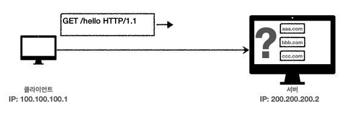

IP로만 통신하고 있기에 어떤 도메인으로 접근하는지 파악이 어려워 HOST를 HTTP메시지에 넣어주어야 한다.

**Location**(페이지 리다이렉션)

### 인증 헤더

- Authorization: 클라이언트 인증 정보를 서버에 전달 - Basic xxxxxxxx
- WWW-Authenticate: 리소스 접근시 필요한 인증 방법 정의
  - 리소스 접근시 필요한 인증 방법 정의
  - 401 Unauthorized 응답과 함께 사용

### 쿠키 헤더

- Set-Cookie: 서버에서 클라이언트로 쿠키 전달(응답)
- Cookie: 클라이언트가 서버에서 받은 쿠키를 저장하고, HTTP요청시 서버로 전달

**쿠키 적용 전**

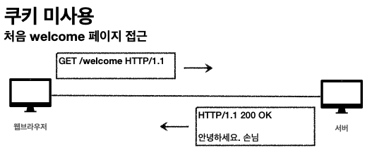

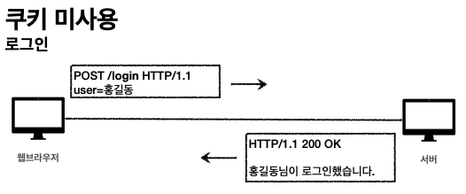

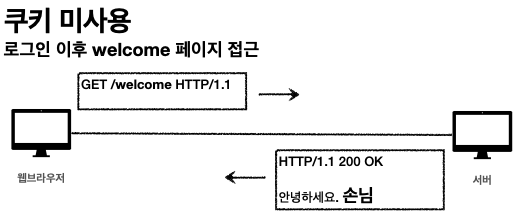

처음 클라이언트에서 welcome 페이지 접근 서버에서는 응답값을 보낸다. 사용자가 로그인 시 서버에서 로그인을 했다는 응답을 받는다. 로그인 이후 다시 welcome 페이지 접근 시 서버는 손님이라는 응답을 보낸다.

→ 서버입장에서는 로그인한 유저의 요청인지 구분할 방법이 없다.

Stateless

- HTTP는 무상태 프로토콜이다
- 클라이언트와 서버가 요청과 응답을 주고 받으면 연결이 끊어진다.
- 클라이언트가 다시 요청하면 서버는 이전 요청을 기억하지 못한다.
- 클라이언트와 서버는 서로 상태를 유지한지 않는다.

대안) 모든요청세 유저정보를 서버에 포함해서 보내는 것이다 하지만 이것은 치면적인 문제가 있다. 모든 요청과 링크에 사용자 정보를 포함해야 하므로 개발이 힘들고 보안에 문제가 있다. 이것을 해결하기 위해 쿠키가 도입되었다.

**쿠키 적용 후**

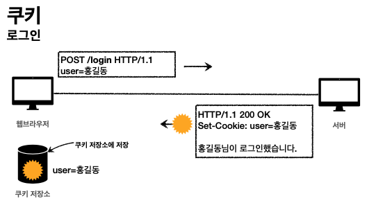

웹브라우저가 로그인 시 서버는 Set-Cookie라고 해서 헤더를 만들어서 응답을 한다. 웹브라우저는 브라우저 쿠키 저장소에 user=홍길동이라는 서버가 보내준 값을 쿠키 저장소에 저장을 해둔다.

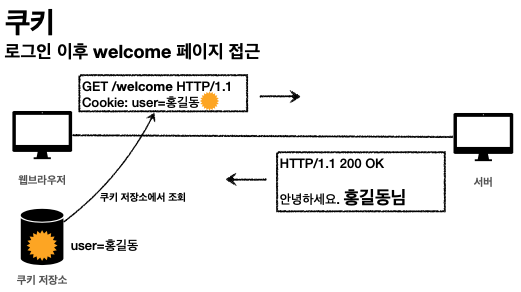

로그인 이후 웹브라우저가 welcome 페이지에 접근하면 자동으로 웹브라우저는 서버에 요청을 보낼 때 마다 쿠키를 꺼내 Cooki: user=홍길동이라는 HTTP 헤더를 만든다.

`쿠키는 모든 요청에 쿠키 정보를 자동으로 포함한다.`

쿠키

ex) **set-cookie: sessionId=abcde1234; expires=Sat, 26-Dec-2020 00:00:00 GMT; path=/; domain=.google.com; Secure**

- 사용처
  - 사용자 로그인 세션 처리 시 많이 사용
  - 광고 정보 트래킹
- 쿠키 정보는 항상 서버에 전송됨
  - 네트워크 트래픽 추가 유발
  - 최소한의 정보만 사용(세션id, 인증 토큰)
  - 서버에 전송하지 않고, 웹브라우저 내부에 데이터를 저장하고 싶으면 웹 스토리지( localStorage, sessionStorage)

쿠키 - 생명주기 Expires, max-age

- **Set-Cookie: expires=Sat, 26-Dec-2020 04:39:21 GMT**
  - **만료일이 되면 쿠키 삭제**
- **Set-Cookie: max-age=3600 (3600초)**
  - **0이나 음수를 지정하면 쿠키 삭제**
- 세션 쿠키 : 만료 날짜를 생략하면 브라우저 종료시 까지만 유지
- 영속 쿠키 : 만료 날짜를 입력하면 해당 날짜까지 유지

쿠키 - 도메인 (Domain)

- ex) domain = [example.org](http://example.org)
- 명시 : 명시한 문서 기준 도메인 + 서브 도메인 포함
- 생략 : 현재 문서 기준 도메인만 적용

쿠티 - 경로 (path)

- 이 경로를 포함한 하위 경로 페이지만 쿠키 접근
- 일반적으로 path=/ 루트로 지정

쿠키 - 보안

- Secure
  - 쿠키는 https, http를 구분하지 않고 전송
  - Secure 를 적용하면 https인 경우에만 전송
- HttpOnly
  - 자바스크립트에서 접근 불가
- SameSite
