# [HTTP] 8. 헤더2 - 캐시와 조건부 요청

## 캐시 기본 동작

**캐시가 없을 때**

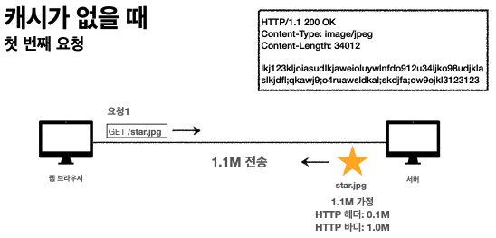

웹브라우저에서 요청을 하면 서버에 응답을 내려준다. 응답 HTTP를 보면 실제 이미지와 관련된 바이트 코드들 이있다. 헤더와 바디 부분을 네트웤을 차지하면서 웹브라우저에 내려와 이미지가 보여준다. 응답이 또오면 헤더와 바디부분을 또 만들어서 다시 내려준다.

- 데이터가 변경되지 않아도 계속 네트워크를 통해서 데이터를 다운로드 받아야 한다.
- 인터넷 네트워크는 매우 느리고 비싸다.
- 브라우저 로딩 속도가 느리다.
- 느린 사용자 경험

**캐시 적용**

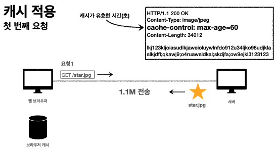

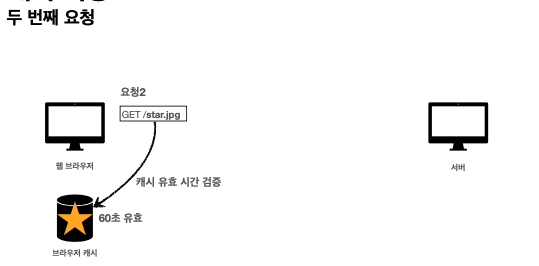

캐시 컨트롤이라는 것을 HTTP 헤더에 넣어줄수있다. 이건 캐시가 유효한 시간을 의미 한다. 60초동안 캐시가 유효하다. 최초로 요청을 할때는 strt.jpg가 내려가면 60초 유효하다고 적어놓고 응답결과를 캐시에 저장하고 두번째 요청 때는 캐시를 먼저 확인하고 캐시가 유효하다면 캐시에서 가져온다(네트워크를 타지않음)

- 캐시 덕분에 캐시 가능 시간동안 네트워크를 사용하지 않아도된다.
- 비싼 네트워크 사용량을 줄일 수 있다.
- 브라우저 로딩 속도가 매우 빠르다.
- 빠른 사용자 경험

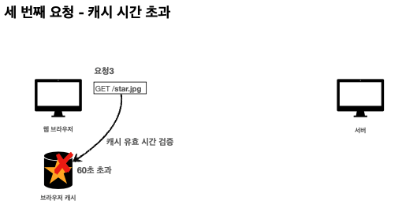

세번째 요청 캐시 시간 초과 일 경우 당연히 다시 요청을 해야 한다. 서버는 똑같은 데이터를 응답하고 브라우저는 캐시를 초기화 하고 60초 유효한 상태를 유지한다. 이과정에서 네트워크는 메모리를 그대로 사용한다.

캐시 시간 초과

- 캐시 유효 시간이 초과하면, 서버를 통해 데이터를 다시 조회하고, 캐시를 갱신한다.
- 이때 다시 네트워크 다운로드가 발생한다.

하지만 이미지가 변하지 않았는데 전체를 다시 다운받는다? 이건 비효율적이다.

## 검증 헤더와 조건부 요청

- 캐시 유효 시간이 초과해서 서버에 다시 요청하면 다음 두가지 상황이 나타난다.
  1. 서버에서 기존 데이터를 변경함
  2. 서버에서 기존 데이터를 변경하지 않음

2번일 경우 용량이 동일한데 처음부터 다시 다운로드 받을 필요가 있을까? → 이것을 해결하기 위해 검증헤더

- 캐시 만료후에도 서버에서 데이터를 변경하지 않음
- 생각해보면 데이터를 전송하는 대신에 저장해 두었던 캐시를 재사용 가능하다.
- 단 클라이언트의 데이터와 서버의 데이터가 같다는 사실을 확인할수 있는 방법이 필요

**검증 헤더 추가**

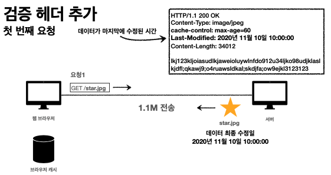

last-Modified를 추가할수 있다. 데이터가 마지막에 수정된 최종일자를 추가하여 응답을 내려줄수 있다. 웹브라우저는 응답결과를 캐시에 저장하고 60초 유효한 값을 저장 데이터 최종 수정일을 기록하고 있음.

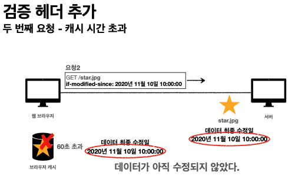

웹브라우저가 60초 초과 후 요청을 보낼때 캐시에 보니깐 last-Modified 있다면 웹브라우저가 if-modified-since라는 HTTP 요청 헤더 날짜를 추가하여 서버에 전송하면 서버에서 요청을 받아 데이터 최종 수정일과 요청한 데이터 수정일을 서버에서 검증할 수 있다.

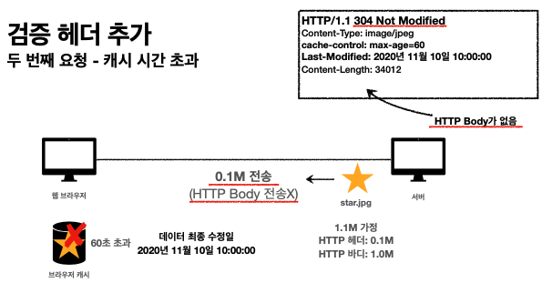

수정이 안된다면 HTTP응답을 만들때 304 Not Modified 요청했는데 변경된것이 없다는 것을 추가한다. 하지만 HTTP Body가 존재하지 않는다. ( ⇒ why? 변화한 데이터가 없기 때문 )

정리

캐시 유효시간이 초과해도 서버의 데이터가 갱신되지 않으면 304 not Modified 와 헤더 메타 정보만 응답(바디X) 클라이언트는 서버가 보낸 응답 헤더 정보로 캐시의 메타 정보를 갱신하며, 클라이언트는 캐시에 저장되어 있는 데이터 재활용가능하다. 결과적으로 네트워크 다운로드가 발생하지만 용량이 적은 헤더 정보만 다운로드 한다.

## 검증 헤더와 조건부 요청 2

- 검증헤더
  캐시데이터와 서버 데이터가 같은지 검증하는 데이터 `Last-modified, Etag`
- 조건부 요청 헤더
  `Last-modified, Etag` 를 활용해서 클라이언트에서 서버로 요청을 할때 조건부 요청헤더를 만들어서 보낸다. 검증헤더로 조건에 따라 분기처리
  - If-Modified-Since: Last-Modified 사용
  - If-None-Match: Etag 사용
  조건이 만조하면 200OK / 조건이 만족하지 않으면 304 Not Modified

Etag, If-None-Match

캐시용 데이터에 임의의 고유한 버전 이름을 달아둔다.

- ex) Etag: v1.0 , ETag: “a2jiodwjekjl3”

데이터가 변경되면 이 이름을 바꾸어서 변경함(Hash를 다시 생성)

진짜 단순하게 Etag만 보내서 같으면 유지 다르면 다시 받기

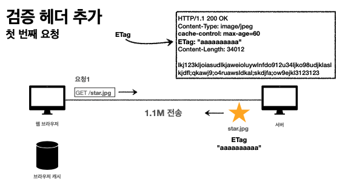

서버에 요청시 ETag를 응답하고 웹브라우저가 Etag값응 캐시에 저장한다. 두번째 요청시 웹브라우저에 가지고 있는 Etag를 보낸다 서버에서 Etag값을 확인해서 성공이면 200 실패면 304

단순하게 ETag만 서버에 보내서 같으면 유지, 다르면 다시 받기! 캐시 제어 로직을 서버에서 완전히 관리 하므로 클라이언트는 캐시 매커니즘을 모름

## 캐시와 조건부 요청 헤더

캐시 제어 헤더

- Cache-Control: 캐시 제어
  - max-age : 캐시 유효 시간, 초 단위
  - no-cahce : 데이터는 캐시해도 되지만, 항상 원(origin)서버에 검증하고 사용
  - no-sotre: 데이터 민감한 정보가 있으므로 저장하면 안됨
- Pragma: 캐시 제어 (하위 호환)
- Expires: 캐시 유효 기간 (하위 호환)

## 프록시 캐시

프록시 캐시라는 캐시 서버를 도입하여 CDN 서비스라고 해서 사용 AWS의 클라우드 프론트

웹브라우저가 프록시 캐시서버에 접근하도록 만들어 origin서버로 보내는 것이 아니라 캐시서버로 요청을 보냄

`CDN서비스는 프록시 캐시를 이용하는군`

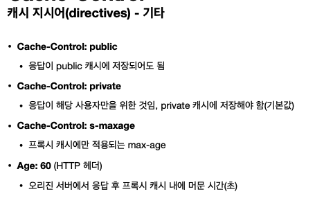

## 캐시 무효화

특정화면이 캐시가 되면 안될때는 이것을 넣어야 한다!!

`Cache-Control: no-cache, no-store, must-revalidate`

`Pragma: no-cache`

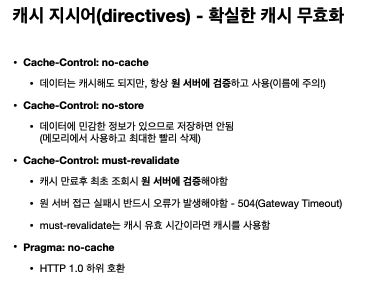

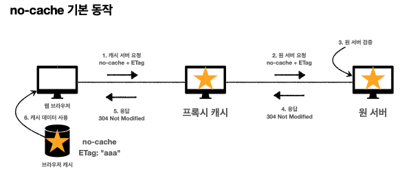
