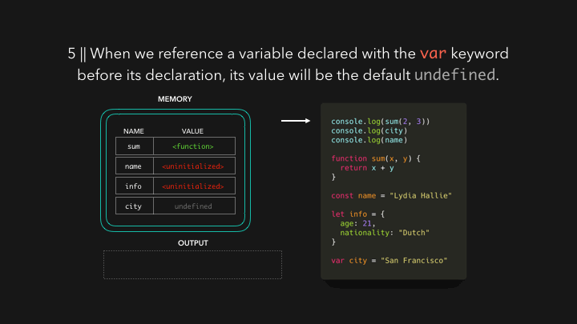

# 02. JS Core : hoisting

호이스팅이란 무엇일까?
자바스크립트를 처음 사용한다면 일부 변수가 임의로 `undefined` 가 되거나, `ReferenceError` 가 발생하는 등 이상한 동작을 경험했던 적이 있다. 호이스팅은 종종 "변수와 함수를 파일 위에 배치하는 것" 으로 설명되고 한다. 동작은 그렇게 보일지 모르지만 실제로 그렇지 않다.

JS엔진이 스크립트를 받으면, 가장 먼저 코드에서 데이터를 위한 메모리를 설정한다. 이 시점에서는 어떤 코드도 실행되지 않고 단지 실행을 위한 준비단계일 뿐이다. 함수의 선언과 변수가 저장되는 방식은 차이가 있다. 함수는 entrie function에 대한 참조와 함께 저장된다.

변수는 다르다.  ES6는 변수를 선언하는 두가지 새로운 키워드 `let`과 `const` 를 도입했다. let, const로 선언된 변수는 초기화 되지 않은 상태로 저장된다.

`var` 로 선언된 변수는 undefined로 초기화 된 상태로 저장된다.

이제 생성 단계가 완료 되어 코드를 실행할수 있다. 
함수, 변수를 선언하기 전에 파일 상단에 console.log문이 있다면 무슨 일이 일어나는지 보자

함수는 entrie function 코드를 참조하며 저장되었기 때문에, 우리는 함수를 선언하는 라인 이전에 그것들을 호출할 수 있다.

var 로 선언된 변수가 선언되기 전에 해당 변수를 참조한다면, 그 변수는 저장된 기본 값인 `undefined` 를 반환한다. 하지만, 이것은 종종 예상치 못한 동작으로 이어질 수 있는데 주로 의도하지 않은 참조를 의미한다.
(실제 undefined를 원하지 않을 수 있음)

var키워드처럼 undefined변수를 실수로 참조하는 것을 방지하기 위해 **초기화 되지 않은 변수에 접근** 하면 ReferenceErrorr가 발생한다. 변수가 실제로 선언된 위치 이전의 영역을 temporal dead zone 이라 부른다. 변수를 초기화하기 전에는 변수를 참조할 수 없다.

엔진이 실제 변수가 선언된 위치를 지나갈 때, 메모리의 해당 변수를 실제 선언된 값으로 덮어 씌운다.

요약
- 함수, 변수는 코드를 실행하기 전에 실행 컨텍스트를 위해 메모리에 저장되며, 이를 호이스팅이라 한다.
- 함수는 entire function을 참조하면서 저장된다.
- var로 선언된 변수는 `undefined` 로 초기화된 상태로 저장된다.
- const, let 으로 선언된 변수는 초기화 되지 않고 저장된다.

[참조] https://dev.to/lydiahallie/javascript-visualized-hoisting-478h