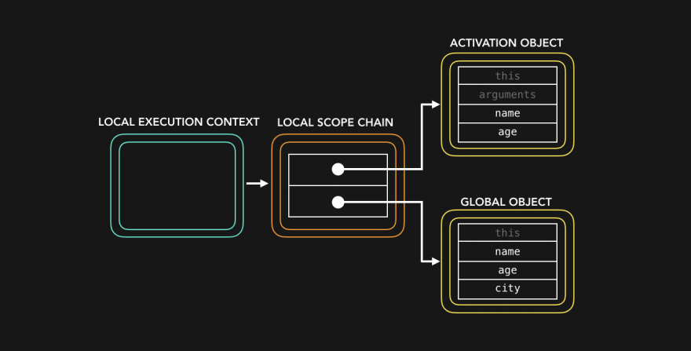
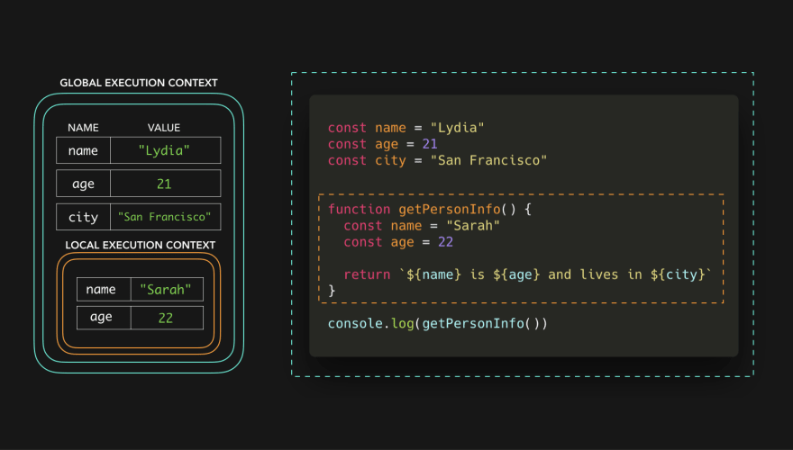
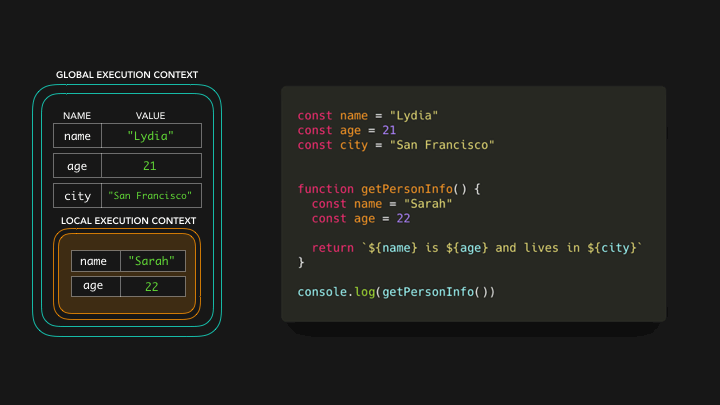
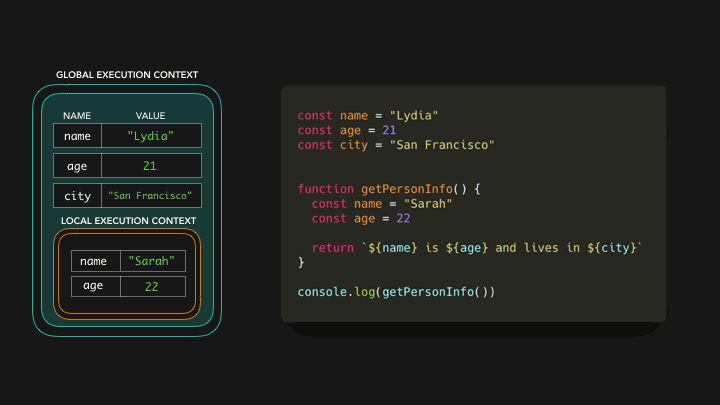
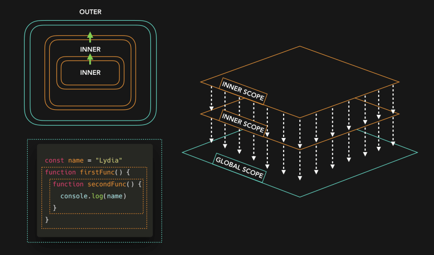
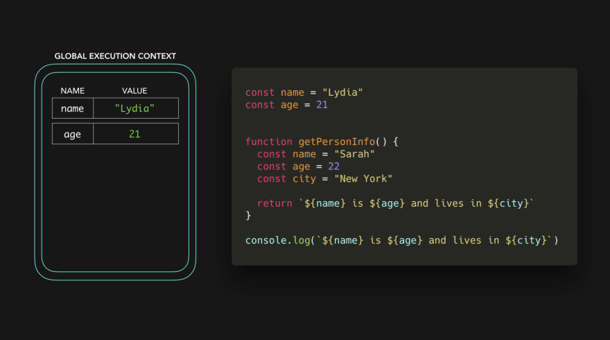

# JS Core : Scope

> Scope란 무엇일까?

다음 코드를 살펴보자!

```js
const name = "Lydia";
const age = 21;
const city = "San Francisco";

function getPersonInfo() {
  const name = "Sarah";
  const age = 22;

  return `${name} is ${age} and lives in ${city}`;
}

console.log(getPersonInfo());
```

`이름` `나이` `도시` 값 변수를 포함한 문자열을 반환하는 `getPersonInfo` 함수를 호출한다.  
`Sarah is 22 and lives in San Francisco`, 하지만 `getPersonInfo`함수는 city를 포함하고 있지 않다. 어떻게 이 함수는 city값을 알고 있을까?

먼저, 메모리 공간은 다른 컨텍스트에 대해 설정된다. 기본적으로 **global context**(브라우저의 window, 노드의 global)와 우리가 호출한 getPersonInfo함수에 대한 **local context**를 갖고 있다. 또한 각 컨테스트는 소코프 체인을 가지고 있다.



스코프 체인은 기본적으로 "참조 체인"이다. 참조 체인은 실행 컨테스트에서 참조할 수 있는 값에 대한 참조를 포함하는 객체에 대한 참조를 폼한한다. 스코프 체인은 실행 컴테스트를 만들 때 생성된다(**런타임에 생성된다**)



글로벌 컨테스트의 스코프 체인은 3개의 변수에 대한 참조를 가지고 있다: `name`은 `Lydia`, `age`는 `21`, `city`는 `San Francisco`.  
로컬 컨테스트에서는 2개의 변수에 대한 참조를 가지고 있다: `name`은 `Sarah`, `age`는 `22`

getPersonInfo 함수에서 변수에 접근할 때, 엔진은 먼저 로컬 컨테스트를 확인한다.



로컬 스코프 체인은 name, age에 대한 참조를 가지고 있다! name은 Sarah, age는 22라는 값을 가지고 있다. 하지만, city에 접근할 때 무슨 일이 일어날까?

city에 대한 값을 찾기 위해서 엔진은 현재 스코프 체인에서 내려간다. 이것은 엔진이 쉽게 포기하지 않는 다는 것을 의미한다. 엔진은 city의 값을 지역 스코프가 참조하는 외부 스코프, 이 경우에는 글로벌 스코프에서 찾을 수 있는지 열심히 일한다.



글로벌 실행 컨텍스트에서 우리는 city를 San Francisco로 선언했다. 따라서 city에 대한 참조를 가지고 있다. 이제 우리는 해당 변수의 값을 가지고 있고, getPersonInfo 함수는 Sarah is 22 and lives in San Francisco를 반환할 수 있다. 🎉

우리는 스코프 체인에서 "외부 스코프로는 갈 수 있지만, 내부 스코프로는 갈 수 없다". 나는 이것을 폭포의 일종으로 시각화하고 싶습니다.



예시 코드를 한번 보자!



거의 비슷하지만, 한 가지 큰 차이점이 있다. 우리는 city를 글로벌 스코프가 아닌getPersonInfo에 선언했다. getPersonInfo 함수를 호출하지 않았으니 로컬 컨텍스트가 생성되지도 않았다. 하지만 우리는 글로벌 컨텍스트에서 name, age, city에 접근하려고 한다.


이것은 ReferenceError를 일으킨다! 글로벌 스코프에서는 city 변수의 참조를 찾을 수 없고, 살펴볼 외부 스코프도 없으며, 스코프 체인을 올라갈 수도 없습니다.

이 방법으로 스코프를 이용해 변수를 "보호"하고, 변수명을 재사용할 수 있다.

전역, 로컬 스코프 외에도 block scope도 있다. let, const로 선언된 변수는 가장 가까운 대괄호로 범위가 지정된다 { }

[요약]

- 현재 컨텍스트에서 접근할 수 있는 값에 대한 참조 체인으로 "scope chain"을 볼 수 있다.
- 스코프는 위가 아닌 아래로만 이동할 수 있기 때문에, 스코프 체인을 따라 더 아래에서 이미 정의된 변수명을 재 사용할 수도 있다.
