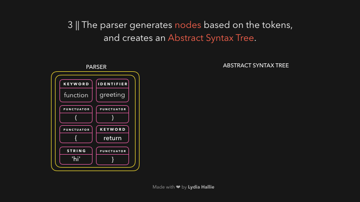

# JS Core : JavaScript Engine


기계는 어떻게 우리가 작성한 코드를 이해할 수 있을까? 자바스크립트 개발자로서 우리는 보톤 "컴파일러"를 직접 다룰 필요는 없다. 하지만 자바스크립트 엔진의 기본적인 내용을 알고, 엔진이 어떻게 인간 친화적인 코드를 다루는지, 그 코드들을 기계가 이해할 수 있는 무언가로 바꾸는 것을 아는 것은 분명 좋은 일이다.

---

\
HTML 파서는 source가 있는 `script태그`를 만난다. 이 소스의 코드는 **네트워크, 캐시** 혹은 **설치된 서비스 워커**로부터 로드됩니다. 응답은 **byte stream**에 요청한 스크립트 이며, **byte stream decoder**가 처리합니다. 바이트 스트림 디코더는 다운로드중인 바이트 스트림을 디코딩합니다.


바이트 스트림 디코더는 디코딩된 바이트 스트림으로부터 **토큰**을 생성한다. 예를 들어
0066은 f로 디코딩 하고,
0075 -> u,
006e -> n,
0063 -> c,
0074 -> t,
0069 -> i,
006f -> o,
006e -> n 로 디코딩 하고 그 뒤에 공백을 붙인다. function을 적은 것 같군요! 이것은 자바스크립트의 예약어이고, 토큰이 생성되어 파서로 보내진다. (gif에는 없지만 "pre-parser"에 대해서는 나중에 설명하겠습니다) 나머지 바이트 스트림도 마찬가지로 진행된다.


엔진은 두 개의 **파서(pre-parser, parser)**를 사용한다. 웹 사이트를 로드하는 시간을 줄이기 위해, 엔진은 당장 필요하지 않은 코드를 파싱하지 않고 회피한다. 프리 파서는 나중에 사용될 코드를 다루고, 파서는 당장 필요한 코드를 파싱한다. 사용자가 버튼을 클릭한 후에만 호출되는 특정 함수의 경우, 웹사이트를 로드하기 위해 즉시 컴파일할 필요는 없다.
사용자가 버튼을 클릭하고, 해당 코드가 요청되면 그 때 해당 코드는 파서로 전달된다.

파서는 바이트 스트림 디코더로부터 전달받은 토큰을 기반으로 노드를 생성하고, 이 노드를 사용해서 Abstract Syntax Tree(AST)를 생성한다.



다음은 **interpreter**의 차례이다!. 인터프리터는 AST를 지나가며 AST에 포함된 정보를 기반으로 **byte code**를 생성한다. 바이트 코드가 완전히 생성되면 AST가 삭제되어 메모리 공간에서 정리된다. 마침내, 우리는 기계가 사용할 수 있는 무언가를 가지고 있다! 🎉


바이트 코드는 빠르지만, 더 빨라질 수 있다. 이 바이트 코드가 실행되면서 정보가 생성된다. 특정 동작이 자주 발생하는지, 어떤 데이터 유형이 사용되었는지 탐지할 수 있다. 아마 함수를 수십번 호출한 적이 있을 것이다. 이제 함수를 최적화하여 더 빨리 실행할 수 있다! 🏃

바이크 코드는 생성된 타입 피드백과 함께 최적화 컴파일러에 전달된다. 최적화 컴파일러는 이 두 가지를 받아 고도로 최적화된 기계어를 생성한다.


자바스크립트는 동적 언어이기에 데이터의 타입이 지속적으로 변경될 수 있다. 자바스크립트 엔진이 매번 특정 값을 가지는 데이터 타입을 확인해야한다면, 매우 느릴것이다

코드 해석에 걸리는 시간을 줄이기 위해, 최적화된 기계어는 바이트 코드를 실행하는 동안 엔진이 이전에 보았던 케이스만 처리한다. 만약 같은 데이터 타입을 반복적으로 반환하는 특정 코드를 반복적으로 실행한다면, 최적화된 기계어를 재사용해서 속도를 높일 수 있다.

하지만 자바스크립트는 동적 언어이기 때문에 동일한 코드 조각이 갑자기 다른 타입의 데이터를 반환할 수 있다. 이 경우, 기계어는 최적화되지 않고 생성된 바이트 코드를 해석하는 엔진으로 돌아간다.

특정 함수가 100번 호출되면서 항상 같은 값을 반환한다고 가정해보자. 101번째 호출에도 같은 값을 반환할거라 예상할 수 있다.

다음과 같은 함수 sum이 있다고 가정해 보자. 이 함수는 항상 숫자값을 인자로 불러왔다.

```js
function sum(a, b) {
  return a + b;
}
sum(1, 2);
```

이 함수는 숫자 3을 반환한다! 다음에도 두 개의 숫자를 인자로 호출될 것이라 가정할 수 있다. 이 경우, 동적 조회(타입이 변경되었는지)를 할 필요가 없고 최적화된 기계어를 재사용할 수 있다. 만약 가정이 틀렸다면 (인자가 숫자가 아니라면) 최적화 기계어 대신 원래 바이트 코드로 되돌아간다.

예를 들어 다음 호출에 숫자대신 문자를 전달합니다. 자바스크립트는 동적 언어이기 때문에 에러 없이 이 동작이 수행된다.

```js
function sum(a, b) {
  return a + b;
}
sum("1", 2);
```

이는 숫자 2가 강제로 문자열로 적용되어 함수가 문자열 '12'를 반환함을 의미한다. 해석된 바이트 코드를 다시 실행하고, 유형 피드백을 업데이트 한다.
