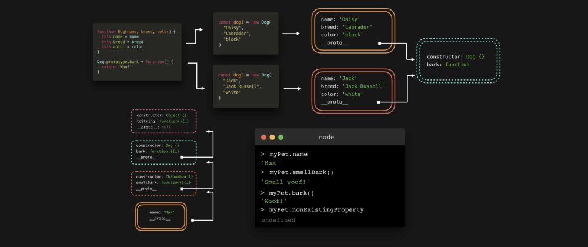

# JS Core - 프로토타입과 상속



문자열, 배열, 객체에서 `.length`, `.split()`, `.join()`과 같은 기본 내장 메소드를 사용할 수 있는 이유가 궁금한적 있나요? 우리는 그 메소드들을 명시한적 없는데 그것들은 어디서 오는걸까? 이제 그것들을 마법이라 하지 마세요. 바로 프로토타입 상속이라 불리는 것 덕분입니다. 이건 꽤 멋지고, 여러분이 알고 있는 것보다 더 자주 사용합니다!

우리는 종종 같은 타입의 객체를 많이 만들어야 합니다. 사람들이 개를 검색할 수 있는 웹사이트가 있다고 가정해 봅시다.

모든 개를 위해, 그 개를 묘사하는 객체가 필요합니다. 매번 새로운 객체를 작성하는 것 대신에, 우리는 constructor function(생성자 함수)를 사용할겁니다. (무슨 생각을 하는지 알지만, 나는 ES6 class를 다룰 때 설명하겠습니다.) 이 생성자 함수는 우리가 `new` 키워드를 사용해서 Dog 인스턴스를 만들 수 있게 해줍니다. (이 게시물에서 생성자 함수에 대한 설명을 설명하진 않습니다. 그러니 너무 자세히 얘기하진 않을게요)

모든 개는 name, breed, color 속성과 bark 함수를 가지고 있습니다.

```js
function Dog(name, breed, color) {
  this.name = name;
  this.breed = breed;
  this.color = color;
  this.bark = function () {
    return "Woof!";
  };
}
```

Dog 생성자 함수를 만들었을 때, 이것은 우리가 만든 유일한 객체가 아니었습니다. 자동적으로, 우리는 또 다른 객체를 만들 수 있고, 이를 프로토타입이라 합니다! 기본적으로, 이 객체는 생성자 속성을 포함하며, 이 속성은 원본 생섬자 함수인 Dog를 참조합니다.


개 생성자 함수의 `프로토타입` 속성은 열거할 수 없고, 이것은 우리가 객체 속성에 접근하려 할 때 표시되지 않는걸 의미합니다. 하지만, 여전히 존재합니다!

자, 그러면.. 이 프로토타입 속성을 사용하는 이유는 무엇일까요? 먼저, 우리가 보여주고 싶은 개 객체를 생성합니다. 저는 간단히 이것들을 `dog1`, `dog2`라고 부르겠습니다. `dog1`의 이름은 Dasiy로 귀여운 블랙 래브라도이고 `dog2`는 Jack, 겁없는 화이트 잭 러셀입니다. 😎

```js
const dog1 = new Dog("Daisy", "Labrador", "black");
const dog2 = new Dog("Jack", "Jack Russell", "white");
```

dog1를 콘솔에 기록해서 속성을 확장해봅시다!


우리가 추가한 속성들, name, breed, color, bark를 볼 수 있습니다. 그런데 proto는 대체 뭘까요!? 이것은 열거할 수 없습니다. 즉, 객체의 속성으로 가져오려고 하면 일반적으로 표시되지 않습니다. 확장해봅시다! 😃


`Dog.protype` 객체와 매우 유사합니다. `__proto__` 는 `Dog.protype` 객체에 대한 참조인것 같네요. 이게 프로토타입 상속에 대한 전부입니다. 생성자의 각 인스턴스는 생성자의 프로토타입에 접근할 수 있습니다!


그럼 이게 왜 멋진걸까요? 때때로 모든 인스턴스가 공유하는 속성이 있습니다. 예를 들면, `bark` 함수는 모든 인스턴스에서 동일한데, 왜 우리는 새로운 dog를 만들 때 마다 매번 새로운 함수를 만들어서 메모리를 소비할까요? 대신에, 우리는 `Dog.prototype` 객체에 이 함수를 추가할 수 있습니다! 🥳


우리가 인스턴스의 속성에 접근하려할 때 마다, 엔진은 먼저 해당 속성이 그 객체 자체에 정의되어 있는지 지역적으로 찾기 시작합니다. 만약 해당 속성을 찾을 수 없다면 `__proto__` **속성을 통해 프로토타입 체인을 타고 내려갑니다.**


이건 한 단계일 뿐이지만, 여러 단계도 포함할 수 있습니다! 따라서 여러분은 `Dog.prototype`을 보여주는 `__proto__`를 확장했을 때, 하나의 속성이 포함되지 않은 것을 알아차렸을 수도 있습니다. `Dog.prototype` 자체는 객체이고, Object 생성자의 인스턴스입니다! 즉, `Dog.prototype` 또한 `__proto__` 속성을 가지고 있으며, 이것은 `Object.prototype`을 참조합니다!


이제 기본 내장 메소드가 어디서 어디서 오는건지 답을 가지고 있습니다. 그것들은 프로토타입 체인에 있습니다!😃

`.toString()` 메소드로 예를 들면, 이 메소드가 `dog1` 객체에 지역적으로 정의되어 있나요? 아닙니다.
`dog1.__proto__`가 참조하고 있는 `Dog.prototype`에 정의되어 있나요? 아닙니다!
이 메소드는 `Dog.prototype.__proto__`가 참조하고 있는 `Object.prototype`에 정의되어 있습니다! 🙌🏼


생성자 함수 (function Dog(){...})의 사용은 자바스크립트에서 여전이 유효합니다. 하지만, ES6는 더 쉽게 생성자의 기능과 프로토타입 작업을 할 수 있는 구문을 도입했습니다. class!!

> class는 생성자 함수에 대한 Syntactic sugar일 뿐입니다. 모든 것은 여전이 같은 방식으로 동작합니다.  
> Syntactic sugar : 컴퓨터 사이언스에서 프로그래밍 동작을 읽고 쓰기 쉽게 디자인된 문법

우리는 class 키워드로 클래스를 작성합니다. class는 생성자 함수를 가지고 있으며, 이는 기본적으로 ES5의 문법에서 우리가 작성한 생성자 함수입니다. 프로토타입에 추가할 속성은 클래스 본문(body)에 정의됩니다.


클래스의 또 다른 굉장한 점은 쉽게 **확장**할 수 있다는 사실입니다.

같은 종류의 개 몇 마리(치와와)를 보여주고 싶다고 가정해보세요. 치와와는 여전히 개입니다. 이 예시를 간단히 하기 위해 `name` 속성만 Dog class에 전달하겠습니다. 또한 치와와는 `Woof!`대신 `Small woof!`라고 짖을 수 있습니다.

확장 클래스에서 우리는 `super` 키워드를 사용해서 부모 클래스의 생성자로 접근할 수 있습니다. 부모 클래스의 생성자가 예상하는 인자는 `super`에 전달합니다( 이 경우에는 `name`)

```js
class Dog {
  constructor(name) {
    this.name = anme;
  }
  bark() {
    return "Woof!";
  }
}

class Chihuahua extends Dog {
  constructor(name) {
    super(name);
  }
  smallBark() {
    return "Small Woof!";
  }
}

const myPet = new Chihuahua("Max");
```

`myPet`은 `Chihuahua.prototype`와 `Dog.prototype`에 접근할 수 있습니다. (자동적으로 `Dog.prototype`가 객체이기 때문에 `Object.prototype`에도 접근할 수 있습니다)


`Chihuahua.prototype`가 `smallBark` 함수를, `Dog.prototype`가 bark 함수를 가지고 있기 때문에, 우리는 `myPat`에서 `smallBark`와 `bark`에 모두 접근할 수 있습니다!

여러분이 상상할 수 있듯, 프로토타입 체인은 영원하지 않습니다. 결국 prototype이 `null`인 객체가 존재하며 그것은 `Object.prototype`입니다! 로컬이나 프로토타입 체인에서 찾을 수 없는 속성에 접근하려한다면 `undefined`가 반환됩니다.


생성자 함수와 class에 대한 모든걸 설명했지만, 프로토타입을 객체에 추가하는 또 다른 방법은 `Object.create`를 사용하는 것입니다. 이 방법은 사용하면 우리는 새로운 객체를 만들 수 있고, 해당 개체의 프로토타입을 정확하게 지정할 수 있습니다.

`Object.create`의 인자로 이미 존재하는 객체를 전달해서 사용합니다. 전달되는 객체는 우리가 생성할 객체의 prototype이 됩니다!

```js
const person = {
  name: "Lydia",
  age: 21,
};

const me = Object.create(person);
```

우리가 방금 생성한 me객체를 콘솔에 찍어봅시다.


우리는 `me` 객체에 어떤 속성도 추가하지 않았습니다. 이 객체는 단지 열거할 수 없는 `__proto__` 속성을 포함하고 있습니다. 이 `__proto__` 속성은 우리가 prototype으로 정의한 `person` 객체를 참조하고, `person` 객체는 `name`, `age` 속성을 갖고 있습니다. `person`은 객체이기 때문에 `person`의 `__proto__` 속성은 Object.prototype입니다. (하지만 읽기 쉽도록 gif에서는 해당 속성을 확장하지 않았습니다!)
