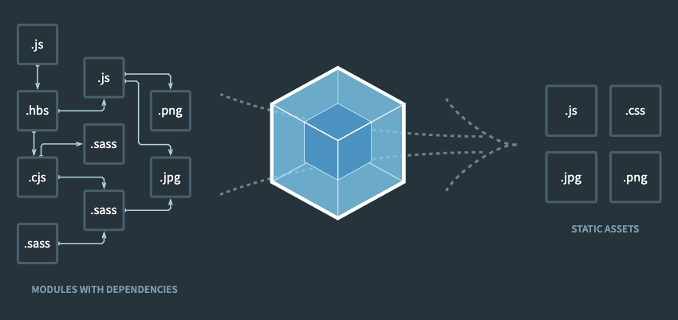

# 02.웹팩 엔트리 아웃풋

### 2. 웹팩 엔트리 / 아웃풋



웹팩은 자바스크립트를 모듈로 만들어준다. (js, img, sass 등 모듈로 인식해서 가져온다.)

모든 시작점을 엔트리 or 엔트리포인트 라고 부른다.

웹팩은 엔트리포인트를 기준으로 모든 모듈을 찾아 하나의 코드로 만들어 준다.

여기서 만들어진 코드를 아웃풋이라고 한다.

> 웹팩은 여러개 파일을 하나의 파일로 합쳐주는 번들러이다.

하나의 시작점(entry point)으로부터 의존적인 모듈을 전 찾아 하나의 겨로가물을 만들어낸다.

웹팩번들링 작업을 해보자

번들 작업을 하는 webpack 패키지와 웹팩 터미널 도구인 webpack-cli를 설치한다.

```sh
npm install -D webpack webpack-cli
```

설치 완료하면 `node_modules/.bin` 폴더에 실행 가능한 명령어가 몇 개 생긴다. webpack과 webpack-cli가 있는데 둘 중 하나를 실행하면 된다. `--help` 옵션으로 사용 방법을 확인해 보자.

`--mode`, `--entry`, `--output-path -o` 세 개 옵션만 사용하면 코드를 묶을 수 있다.

```sh
$: webpack --mode development --entry ./src/app.js -o ./dist/main.js
```

<script src="./dist/main.js"></script>

옵션 중 `--config` 항목을 보자.

이 옵션은 웹팩 설정파일의 경로를 지정할 수 있는데 기본 파일명이 webpack.config.js 혹은 webpackfile.js다. `webpack.config.js` 파일을 만들어 방금 터미널에서 사용한 옵션을 코드로 구성해 보자.

```js
const path = require("path"); // node path

module.exports = {
  mode: "development", // --mode 설정
  entry: {
    // --entry point 설정
    main: "./src/app.js", // [main] name key 설정
  },
  output: {
    // --output-path 설정
    filename: "[name].js",
    path: path.resolve("./dist"),
  },
};
```

터미널에서 사용한 옵션인 mode, entry, ouput을 설정한다.

- mode는 'development' 문자열을 사용했다.
- entry는 어플리케이션 진입점인 src/app.js로 설정한다.
- ouput에 설정한 '[name]'은 entry에 추가한 main이 문자열로 들어오는 방식이다.
  output.path는 절대 경로를 사용하기 때문에 path 모듈의 resolve() 함수를 사용해서 계산했다. (path는 노드 코어 모듈 중 하나로 경로를 처리하는 기능을 제공한다)

웹팩이 구동되면 name(파일이름), est(확장자), hash 변수가 발생할 수 있기에 name을 잡아 줄 필요가 있다.
