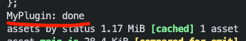

# 04.웹팩 플러그인

### 5.1 플러그인의 역할

> 플러그인은 후처리를 담당한다.

웹팩이 각 모듈들이 로더가 처리한 후 웹팩이 처리된 파일들을 하나로 모은다. 하나로 만들어 내기 전에 후처리를 해준다. 빈칸을 줄이거나 변수명을 바꾸거나 이러한것들을 해주는 것이 **플러그인**이다.

### 5.2 커스텀 플러그인 만들어보기

로더는 일반 함수인 반면에 플러그인은 클래스형태로 정의한다.

```js
class MyPlugin {
  apply(compiler) {
    compiler.hooks.done.tap("My Plugin", stats => {
      console.log("MyPlugin: done");
    });
  }
}

module.exports = MyPlugin;
```

웹팩이 컴파일러 라는 변수를 넣어준다. 플러그인이 완료된 시점에 몇번동작하는지 확인해보자

플러그인을 웹팩 설정에 추가한다.

```js
//webpack.config.js:

const MyPlugin = require("./myplugin");

module.exports = {
  plugins: [new MyPlugin()],
};
```

웹팩 설정 객체의 plugins 배열에 설정한다. 클래스로 제공되는 플러그인의 생성자 함수를 실행해서 넘기는 방식이다.



파일이 여러개인데 로그는 한번만 찍혔다. 모듈이 파일 하나 혹은 여러 개에 대해 동작하는 반면 플러그인은 하나로 번들링된 결과물을 대상으로 동작한다.

### 6. 자주사용하는 플러그인

### 6.1 BannerPlugin

### 6.2 DefinePlugin

> 빌드타임에 주입되어야 할떄 사용하면 좋다.

### 6.3 HtmlTemplatePlugin

> HTML 파일을 후처리하는데 사용한다. 빌드 타임의 값을 넣거나 코드를 압축할수 있다.

```sh
npm install -D html-webpack-plugin
```

### 6.4 CleanWebpackPlugin

> 빌드 결과물(output)을 정리해준다.

### 6.5 MiniCssExtractPlugin

스타일시트가 점점 많아지면 하나의 자바스크립트 결과물로 만드는 것이 부담일 수 있다. 번들 결과에서 스트일시트 코드만 뽑아서 별도의 CSS 파일로 만들어 역할에 따라 파일을 분리하는 것이 좋다. 브라우져에서 큰 파일 하나를 내려받는 것 보다, 여러 개의 작은 파일을 동시에 다운로드하는 것이 더 빠르다.

개발 환경에서는 CSS를 하나의 모듈로 처리해도 상관없지만 프로덕션 환경에서는 분리하는 것이 효과적이다. MiniCssExtractPlugin은 CSS를 별로 파일로 뽑아내는 플러그인이다.

```sh
npm install -D mini-css-extract-plugin
```

[참조](https://jeonghwan-kim.github.io/series/2019/12/10/frontend-dev-env-webpack-basic.html#62-defineplugin)
