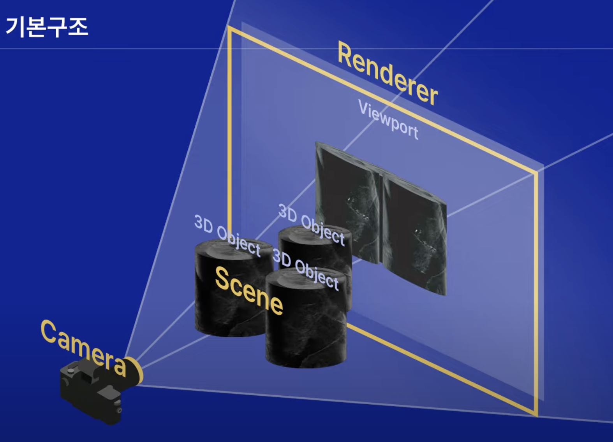
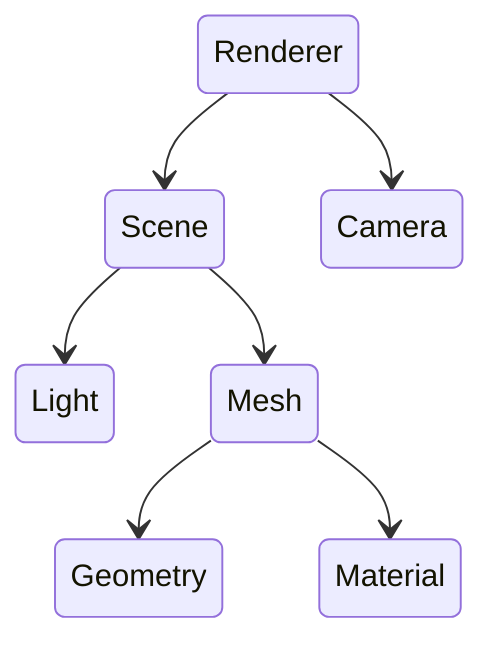

### Threejs 란

3D 객체를 쉽게 렌더링하도록 도와주는 자바스크립트 라이브러리이다.
3D객체를 렌더링 하는데 WebGL을 사용한다.

> WebGL이란 점, 선, 삼각형만을 그리는 단순한 시스템이다.
> WebGL로 직접 무언가를 만들려면 많은 양의 코드를 짜야 한다. Scenes, 광원, 그림자, 물체, 텍스처 등 3차원 세계를 구현한다면 코드 자체도 복잡해 진다. Three.js는 이런 3D요소들의 처리를 도와 직관적인 코드를 도와 준다.

### 기본구조

가장 기본적인 구조 3가지 Renderer / Scene / Camera 이다

> 장면을 만들어서 3D오젝트를 주입시켜 카메라로 비춘다음 렌더러를 통해 HTML파일안에 보여준다.



#### 기본구조



#### Renderer

> 렌더러 : 카메라에 담긴 장면을 웹사이트에 구현해주는 렌더러

```js
// 렌더러
const renderer = new THREE.WebGLRenderer({
  antialias: true,
  alpha: true,
});
renderer.setSize(window.innerWidth, window.innerHeight);
document.body.appendChild(renderer.domElement);
```

#### Camera

- 장면을 화면에 담기 위한 카메라
- 시야각, 종횡비, 카메라 시작 끝 지점, 카메라 위치 등 설정

```js
// 카메라
const camera = new THREE.PerspectiveCamera(
  75,
  window.innerWidth / window.innerHeight,
  0.1,
  1000
);
camera.position.z = 3;
```

#### Scene 장면

- 배경색, 안개 등의 요소 포함
- 여러개의 3D 오브젝트와 빛들이 모인 장면

```js
// 장면
const scene = new THREE.Scene();
scene.background = new THREE.Color(0x004fff);
```

#### Mesh

##### Geometry : 도형

- 기하학 객체의 정점 데이터.
- 구(sphere), 정육면체(cube), 면(plane)

##### Material : 재질

- 기하학 객체를 그리는 표면 속성
- 색이나 밝기
- Texture

```js
// 매쉬
const geometry = new THREE.BoxGeometry(1, 1, 1);
const material = new THREE.MeshStandardMaterial({ color: 0x44aa88 });
const cube = new THREE.Mesh(geometry, material);
scene.add(cube);
```
